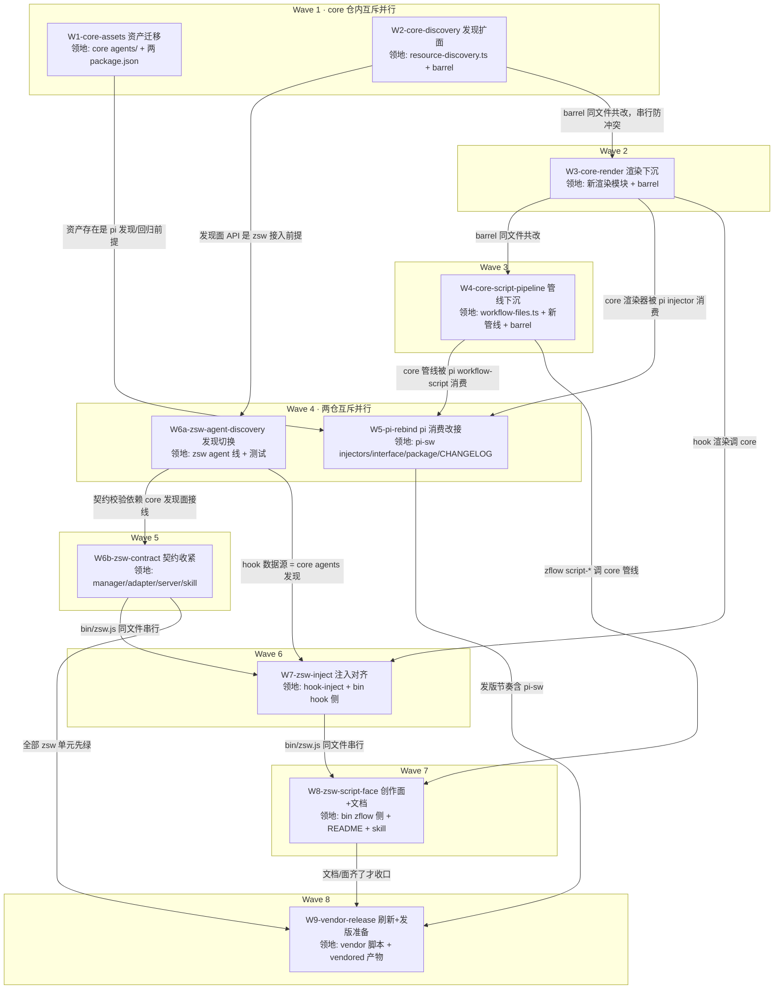

# subagent-core-convergence 实施计划

基线: 待基线 commit | 来源设计: [subagent-core-convergence-design.md](subagent-core-convergence-design.md) | 日期: 2026-08-30

**跨两仓说明**：W1-W5 在 xyz-agent 仓（`/Users/zhushanwen/Code/xyz-agent-workspace/feat-subagent-core-host-surface/`，分支 `feat-subagent-core-host-surface`），W6-W9 在 zsw 仓（本 worktree）。git 单点不变：subagent 零 git，主 agent 在两仓各自精确路径 add/commit。

**审查通过证据**：设计文档附录「审查循环记录与被否谱系」——四轮对抗审查（R1 4MF/7S/3DE → R2 1MF/5S/3DE → R3 1MF/2S/1DE → R4 0MF 设计就绪 + 2S 当轮修完），commit `81f3d2d`。

## 0 章节映射

| 内容 | 设计文档实际位置 |
|------|------------------|
| 背景/目标 | §1 背景目标（1.3 设计目标 G1-G6；1.4 In/Out scope） |
| 终态/机制 | §3 解决方案（3.0 收口判据；3.1 终态样例含失败路径；3.2 决策 D-1~D-6；3.3 探针状态 ✅/⛔） |
| 验收场景表 | §4 验收（A1-A9，含场景/步骤/通过标准/回溯目标） |
| 下一层拆分 | §5.1 实施单元 W1-W9 + 依赖序；§5.2 版本与发版节奏 |
| 待验证检查点 | §5.3（4 项：project 槽 API 形态 / .zcode tmp 排除 / 预算值实测 / dev 拓扑扫描确认） |

## 1 目标快照（逐字摘录自设计 §1.3 / §1.4）

**设计目标**：
- **G1 资产同源**：内置 agent 模板与内置 workflow 一样，一处维护（core 包）、两侧同版本分发。zcode 用户开箱即用 reviewer/orchestrator 等 10 个角色。
- **G2 契约统一**：两平台的引用契约一致——subagent 的 `agent` 参数 = .md 绝对路径；workflow 引用 = 内置名或 .js 绝对路径。模型在任一平台学到的用法可无损迁移。
- **G3 注入对齐**：会话启动时两平台注入同构的资源清单段（subagents/workflows/models），字段口径统一（含 location 路径、模型窗口/能力标记）。
- **G4 创作闭环**：workflow 脚本的 generate→lint→save→delete 管线 core 化，zcode 侧同等可用（落盘目录按宿主布局）。
- **G5 双实现收敛**：agent 发现只剩 core 一套实现；zsw 自有 resolver 退役。
- **G6 维护成本**：新增一个内置角色/一次注入格式调整，只改 core 一处 + 版本发布，两插件随消费面自然获得。

**Out of scope**（摘录）：平台固有差异的强行对齐（triggerTurn vs mailbox、每 turn vs 一次性注入、双引擎切换、TUI/GUI 面差异）；zsub 生命周期/ledger、reaper、slots、jsonout、prompt 拼装措辞；core 的引擎/编排内核行为变更；pi-sw 的 fork/conversation/idleTimeout 等会话级参数向 zsw 的移植。执行通道终态演进（app-server 常驻化）见 [zcode-engine-appserver-decision-record.md](zcode-engine-appserver-decision-record.md)，用户单独处理，与本计划正交。

## 2 单元列表

| Unit | 仓 | 职责 | 领地（精确文件路径） | 依赖 | 隔离 | 验收条款 |
|-----|----|------|---------------------|------|------|---------|
| W1-core-assets | xyz | 10 个 agent 模板迁入 core + 去 tools 化 + pi-sw manifest/白名单清理 | `packages/subagent-core/agents/*.md`（新，10 个）；`packages/subagent-core/package.json`（files+agents/）；`extensions/universal/subagent-workflow/agents/`（整目录删）；`extensions/universal/subagent-workflow/package.json`（pi.agents + files 清理） | — | plain | ① core `agents/` 10 个 .md，frontmatter 无 `tools` 字段、body 无平台工具名硬编码（grep 验证）② pi-sw `agents/` 目录不存在 ③ 两 package.json 无残留引用 ④ core vitest 绿 |
| W2-core-discovery | xyz | async 发现链 realpath 去重 + project host 槽 + hostRoots 同标签多根（Map→列表+硬编码槽合并，原根后置）+ 漂移注释修 | `packages/subagent-core/src/shared/resource-discovery.ts`；`src/index.ts`（barrel，agents 面导出补齐）；`src/__tests__/`（新增/改，下同） | — | plain | ① vitest 绿（含多链同文件去重、同标签多根、撞名本体胜、子目录/node_modules 三维度对照）② pi 单条目形态改前后 `discoverResources` 输出逐项一致（对照探针，记录进证据）③ `scanDirectorySync` 漂移注释已修 |
| W3-core-render | xyz | 三 format 函数 + Entry 接口下沉 core；ModelEntry 并集 + 全字段守卫；分段条目预算参数；sortByCodepoint；guide 参数化；xml-injection 出 barrel | `packages/subagent-core/src/shared/`（新渲染模块，命名执行期定）；`src/index.ts`；`src/__tests__/` | W2（barrel 同文件串行） | plain | ① 渲染单测绿：undefined input/contextWindow 不抛不渲垃圾、码点序+截尾、预算边界（15/10）、guide 由宿主注入 ② barrel 导出探针（node require 逐名检查） |
| W4-core-script-pipeline | xyz | getTmpDir/getSavedDir 参数化；generate 校验管线（ESM/meta/agent()/语法/round-trip）+ tmp 写盘下沉；save/delete/generate 出 barrel | `packages/subagent-core/src/orchestration/workflow-files.ts`；`src/orchestration/`（新管线模块）；`src/index.ts`；`src/__tests__/` | W3（barrel 同文件串行） | plain | ① 管线单测绿：ESM 样本拒（报错含行列）、无 meta 拒、无 agent() 拒、合法样本落 tmp ② 参数化目录注入生效（非 .pi 硬编码）③ barrel 探针 |
| W5-pi-rebind | xyz | pi-sw 改消费 core 新面：injector 调 core format（guide 传 pi 版）、workflow-script 调 core 管线、run 放开内置名、依赖下限、CHANGELOG | `extensions/universal/subagent-workflow/src/injectors/`（3 文件）；`src/interface/tool-workflow.ts`；`src/interface/tool-workflow-script.ts`；`package.json`（依赖 ≥0.4.0）；`CHANGELOG.md` | W1（资产）、W3（渲染）、W4（管线） | plain | ① pi-sw vitest 全绿 ② 注入快照：除 10 内置角色 location 前缀外逐字节等价（用户/项目资源 location 不豁免）③ workflow run 传内置名可跑 ④ core 包根接线实测（§5.3.4 检查点：约定扫描不命中则走 hostRoots 注入降级并记录） |
| W6a-zsw-agent-discovery | zsw | agent 发现换 core：四根 hostRoots 映射 + vendored agents 进 npm 槽（dir=`lib/vendor/`）+ 目录 symlink 展开预处理（本体后置）+ agent-md-resolver 退役 | `z-subagent-workflow/lib/agent-md-resolver.js`（删）；`lib/orchestration-host.js`；`lib/agent-runner-adapter.js`；`lib/manager.js`（resolver 消费点）；`bin/zsw.js`（agents 数据源）；`dist/mcp/server.js`（agents action 面）；`test/`（resolver 测试迁删 + 新增接入测试） | W1、W2；前置主 agent 操作：core `build:bundle` + `vendor --local` 刷新 | plain | ① 增量 `node --test` 相关文件绿 ② 对照探针：同目录集新旧实现 diff 清单一致（含子目录/node_modules/撞名→本体胜三维度，证据落盘）③ `zsw agents` 列出 vendored 10 个 + 用户四根 ④ grep `agent-md-resolver` 零引用 |
| W6b-zsw-contract | zsw | 契约收紧：agent 仅路径 + core 同源报错文案；缺省走 general-purpose 角色；agents 输出补 location | `z-subagent-workflow/lib/manager.js`（start 校验/缺省解析）；`lib/agent-runner-adapter.js`（报错同源）；`bin/zsw.js`；`dist/mcp/server.js`（参数描述/输出）；`skills/zsub-zflow-orchestration/SKILL.md`（契约段）；`commands/` 下 zsw 命令文档（若涉 agent 契约） | W6a | plain | ① 正反例测试：传名拒（文案与 core `agent-registry` 同源断言）+ 传路径成 + 缺省 record.agent=general-purpose ② `zsw agents` 输出含路径列 |
| W7-zsw-inject | zsw | hook 注入改调 core 三段渲染：分段预算、agents 带 location、models 带 contextWindow/reasoning | `z-subagent-workflow/lib/hook-inject.js`（重写渲染层）；`bin/zsw.js`（hook session-start 数据组装：core 发现 + model 投影）；`test/`（hook 测试改） | W6a（agents 发现数据源）、W3（core 渲染） | plain | ① 注入块快照：三段 XML tag/字段集与 pi 同构、10 内置带 location、models 段含窗口/档位（v2 config 真实数据）② 构造 20+ agents：subagents 段码点序截尾 + 兜底指引、models 段完整 ③ `node --test` hook 相关绿 |
| W8-zsw-script-face | zsw | zflow 扩 script-generate/save/delete（CLI + commands + skill 三面）+ README 迁移表 + description 更新 | `z-subagent-workflow/bin/zsw.js`（zflow script-* 子命令）；`dist/mcp/server.js`（zflow 描述）；`README.md`；`package.json`（description）；`skills/zsub-zflow-orchestration/SKILL.md`；`commands/` zsw 命令文档 | W4（core 管线）、W6b/W7（bin/zsw.js 同文件串行） | plain | ① 创作闭环 CLI 真跑：ESM 版拒（含行列）→ 修正 → lint → save 落 `~/.zsw/workflows/` → run 路径引用跑通 → delete 清理 ② README 迁移表含四行（agent 名/agent 缺省/script:/裸名）③ `node --test` 绿 |
| W9-vendor-release | 两仓 | vendor 脚本扩 `capabilities.agentsAssets`；`--npm 0.4.0` 刷新（core 发版后）；check 双绿；发版节奏落地 | `scripts/vendor-subagent-core.js`；`z-subagent-workflow/lib/vendor/subagent-core/`（刷新产物）；发版操作（core 0.4.0 changeset/pi-sw/zsw release.js） | W5-W8 全部 | plain | ① A8 同源校验：vendored agents/ 与 npm 包 sha256 一致、manifest 含 agentsAssets ② `check-sync`/`check-pack` 双绿 ③ 发版与 push 等用户另行授权（本单元只备好） |

## 3 DAG 图

串行链说明：W2→W3→W4 仅为 `src/index.ts`（barrel）同文件共改的保守串行（产物互不依赖）；zsw 侧 W6a→W6b→W7→W8 因 `bin/zsw.js`/`dist/mcp/server.js` 多点共改串行；Wave 4 的 W5 与 W6a 分属两仓文件零交集，真并行。

## 4 测试策略

| 仓 | 增量（单元开发期） | 全量（收尾/阶段门） |
|----|--------------------|---------------------|
| xyz-agent core | `cd packages/subagent-core && pnpm vitest run <相关文件>`（scripts 真实名执行期从 package.json 核对）+ `pnpm typecheck`（若有） | core 包 vitest 全量 + typecheck |
| xyz-agent pi-sw | `cd extensions/universal/subagent-workflow && pnpm vitest run <相关>` | pi-sw vitest 全量 |
| zsw | `node --test test/<file>.test.js`（单文件路径形态；禁目录参数） | `node --test`（无参全量） |
| 跨仓一致性 | — | `node scripts/check-sync.js` + `node scripts/check-pack.js`（zsw 仓根） |
| 真机 e2e | — | Gate B 按 A1-A9 场景表（真实 zcode/pi 环境） |

## 5 合理偏差登记表

（初始为空；执行期按 dev-flow 偏差三分类登记）

## 6 状态表

| Unit | 状态 | 轮次 | 证据指针 |
|------|------|------|---------|
| W1-core-assets | delegated（用户单独处理） | — | handoff: /tmp/handoff-xyz-subagent-core-convergence-20260830.md |
| W2-core-discovery | delegated（用户单独处理） | — | 同上 |
| W3-core-render | delegated（用户单独处理） | — | 同上 |
| W4-core-script-pipeline | delegated（用户单独处理） | — | 同上 |
| W5-pi-rebind | delegated（用户单独处理） | — | 同上 |
| W6a-zsw-agent-discovery | pending（阻塞：等 W1+W2 committed + core bundle 可构建） | 0 | — |
| W6b-zsw-contract | pending | 0 | — |
| W7-zsw-inject | pending | 0 | — |
| W8-zsw-script-face | pending | 0 | — |
| W9-vendor-release | pending | 0 | — |

## 7 残留风险与变更历史

### 残留风险

1. **xyz-agent 分支认知外提交**：`feat-subagent-core-host-surface` 在我方 commit `88d7eadc6` 之后有 22 个新提交（steer/followUp 气泡、更新网络韧性两条任务线）。已核实 `git diff --name-only 88d7eadc6..HEAD` 与 W1-W5 领地（`packages/subagent-core`、`extensions/universal/subagent-workflow`）**交集为 0**，叠加开发安全；执行期每波派发前主 agent 复核该分支无新增领地内变更。
2. **vendor 中间刷新**：W6a 前需主 agent 在 xyz 仓跑 core `build:bundle` 后 `node scripts/vendor-subagent-core.js --local <xyz worktree 路径>` 刷新 zsw vendored 副本（开发态消费未发布的 core 0.4.0 面）；W9 才切 `--npm 0.4.0`（core 发布后）。
3. **core 0.3.0 发版节奏**：0.3.0（host-surface）在用户侧待发；本计划全部落在 0.4.0（minor changeset）。local vendor 模式不被 0.3.0 阻塞；若 0.3.0 未发而 0.4.0 需求先合，changeset 合并为一个 minor（执行期与用户确认）。
4. **发版与 push 授权边界**：W9 的 release.js bump/tag（本地操作）与一切 push/合并 main 动作均需用户另行授权；本计划终态 = 两仓本地 committed + 验收双绿。
5. **§5.3 四个待验证检查点**（设计文档）：project 槽 API 形态、`.zcode` tmp 排除、预算值实测、dev 拓扑扫描确认——分别在 W2/W6a/W7/W5 执行期内以探针落证并回填设计检查点。
6. **e2e token 纪律**：Gate B 真机场景用最小任务书；除 A1/A5/A9 必须真模型外，其余场景优先结构断言。

### 变更历史

- 2026-08-30：计划创建（dev-flow 阶段 1，用户评审确认切分粒度与验收条款）。
- 2026-08-30：**分工移交**——用户决定 xyz-agent 侧施工（W1-W5）单独处理，handoff 文档 `/tmp/handoff-xyz-subagent-core-convergence-20260830.md`（含设计红线、完成定义、分支认知外提交零交集证据）。本会话保留 zsw 侧 W6a-W9；**W6a 开工前置** = 用户侧 W1+W2 committed 且 core `build:bundle` 可构建 → 主 agent `vendor --local` 刷新 vendored 副本后启动。W7 额外依赖 W3、W8 额外依赖 W4（同一前置信号覆盖）。基线 commit 本计划。
