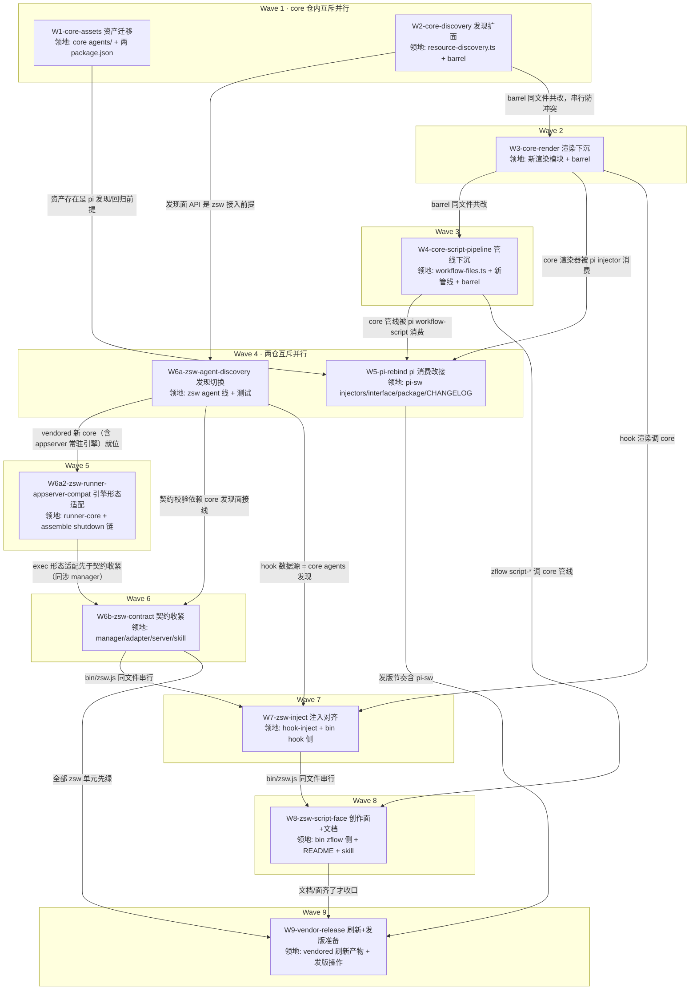

# subagent-core-convergence 实施计划

基线: d0ca6de | 来源设计: [subagent-core-convergence-design.md](subagent-core-convergence-design.md) | 日期: 2026-08-30

**跨两仓说明**：W1-W5 在 xyz-agent 仓（`/Users/zhushanwen/Code/xyz-agent-workspace/feat-subagent-core-host-surface/`，分支 `feat-subagent-core-host-surface`），W6-W9 在 zsw 仓（本 worktree）。git 单点不变：subagent 零 git，主 agent 在两仓各自精确路径 add/commit。

**审查通过证据**：设计文档附录「审查循环记录与被否谱系」——四轮对抗审查（R1 4MF/7S/3DE → R2 1MF/5S/3DE → R3 1MF/2S/1DE → R4 0MF 设计就绪 + 2S 当轮修完），commit `81f3d2d`。

## 0 章节映射

| 内容 | 设计文档实际位置 |
|------|------------------|
| 背景/目标 | §1 背景目标（1.3 设计目标 G1-G6；1.4 In/Out scope） |
| 终态/机制 | §3 解决方案（3.0 收口判据；3.1 终态样例含失败路径；3.2 决策 D-1~D-6；3.3 探针状态 ✅/⛔） |
| 验收场景表 | §4 验收（A1-A9，含场景/步骤/通过标准/回溯目标） |
| 下一层拆分 | §5.1 实施单元 W1-W9 + 依赖序；§5.2 版本与发版节奏 |
| 待验证检查点 | §5.3（4 项：project 槽 API 形态 / .zcode tmp 排除 / 预算值实测 / dev 拓扑扫描确认） |

## 1 目标快照（逐字摘录自设计 §1.3 / §1.4）

**设计目标**：
- **G1 资产同源**：内置 agent 模板与内置 workflow 一样，一处维护（core 包）、两侧同版本分发。zcode 用户开箱即用 reviewer/orchestrator 等 10 个角色。
- **G2 契约统一**：两平台的引用契约一致——subagent 的 `agent` 参数 = .md 绝对路径；workflow 引用 = 内置名或 .js 绝对路径。模型在任一平台学到的用法可无损迁移。
- **G3 注入对齐**：会话启动时两平台注入同构的资源清单段（subagents/workflows/models），字段口径统一（含 location 路径、模型窗口/能力标记）。
- **G4 创作闭环**：workflow 脚本的 generate→lint→save→delete 管线 core 化，zcode 侧同等可用（落盘目录按宿主布局）。
- **G5 双实现收敛**：agent 发现只剩 core 一套实现；zsw 自有 resolver 退役。
- **G6 维护成本**：新增一个内置角色/一次注入格式调整，只改 core 一处 + 版本发布，两插件随消费面自然获得。

**Out of scope**（摘录）：平台固有差异的强行对齐（triggerTurn vs mailbox、每 turn vs 一次性注入、双引擎切换、TUI/GUI 面差异）；zsub 生命周期/ledger、reaper、slots、jsonout、prompt 拼装措辞；core 的引擎/编排内核行为变更；pi-sw 的 fork/conversation/idleTimeout 等会话级参数向 zsw 的移植。执行通道终态演进（app-server 常驻化）见 [zcode-engine-appserver-decision-record.md](zcode-engine-appserver-decision-record.md)，用户单独处理，与本计划正交。

## 2 单元列表

| Unit | 仓 | 职责 | 领地（精确文件路径） | 依赖 | 隔离 | 验收条款 |
|-----|----|------|---------------------|------|------|---------|
| W1-core-assets | xyz | 10 个 agent 模板迁入 core + 去 tools 化 + pi-sw manifest/白名单清理 | `packages/subagent-core/agents/*.md`（新，10 个）；`packages/subagent-core/package.json`（files+agents/）；`extensions/universal/subagent-workflow/agents/`（整目录删）；`extensions/universal/subagent-workflow/package.json`（pi.agents + files 清理） | — | plain | ① core `agents/` 10 个 .md，frontmatter 无 `tools` 字段、body 无平台工具名硬编码（grep 验证）② pi-sw `agents/` 目录不存在 ③ 两 package.json 无残留引用 ④ core vitest 绿 |
| W2-core-discovery | xyz | async 发现链 realpath 去重 + project host 槽 + hostRoots 同标签多根（Map→列表+硬编码槽合并，原根后置）+ 漂移注释修 | `packages/subagent-core/src/shared/resource-discovery.ts`；`src/index.ts`（barrel，agents 面导出补齐）；`src/__tests__/`（新增/改，下同） | — | plain | ① vitest 绿（含多链同文件去重、同标签多根、撞名本体胜、子目录/node_modules 三维度对照）② pi 单条目形态改前后 `discoverResources` 输出逐项一致（对照探针，记录进证据）③ `scanDirectorySync` 漂移注释已修 |
| W3-core-render | xyz | 三 format 函数 + Entry 接口下沉 core；ModelEntry 并集 + 全字段守卫；分段条目预算参数；sortByCodepoint；guide 参数化；xml-injection 出 barrel | `packages/subagent-core/src/shared/`（新渲染模块，命名执行期定）；`src/index.ts`；`src/__tests__/` | W2（barrel 同文件串行） | plain | ① 渲染单测绿：undefined input/contextWindow 不抛不渲垃圾、码点序+截尾、预算边界（15/10）、guide 由宿主注入 ② barrel 导出探针（node require 逐名检查） |
| W4-core-script-pipeline | xyz | getTmpDir/getSavedDir 参数化；generate 校验管线（ESM/meta/agent()/语法/round-trip）+ tmp 写盘下沉；save/delete/generate 出 barrel | `packages/subagent-core/src/orchestration/workflow-files.ts`；`src/orchestration/`（新管线模块）；`src/index.ts`；`src/__tests__/` | W3（barrel 同文件串行） | plain | ① 管线单测绿：ESM 样本拒（报错不含行列——core 契约，行列只在 @pi-meta round-trip 闸）、无 meta 拒、无 agent() 拒、合法样本落 tmp ② 参数化目录注入生效（非 .pi 硬编码）③ barrel 探针 |
| W5-pi-rebind | xyz | pi-sw 改消费 core 新面：injector 调 core format（guide 传 pi 版）、workflow-script 调 core 管线、run 放开内置名、依赖下限、CHANGELOG | `extensions/universal/subagent-workflow/src/injectors/`（3 文件）；`src/interface/tool-workflow.ts`；`src/interface/tool-workflow-script.ts`；`package.json`（依赖 ≥0.4.0）；`CHANGELOG.md` | W1（资产）、W3（渲染）、W4（管线） | plain | ① pi-sw vitest 全绿 ② 注入快照：除 10 内置角色 location 前缀外逐字节等价（用户/项目资源 location 不豁免）③ workflow run 传内置名可跑 ④ core 包根接线实测（§5.3.4 检查点：约定扫描不命中则走 hostRoots 注入降级并记录） |
| W6a-zsw-agent-discovery | zsw | agent 发现换 core：四根 hostRoots 映射 + vendored agents 进 npm 槽（dir=`lib/vendor/`）+ 目录 symlink 展开预处理（本体后置）+ agent-md-resolver 退役；**vendor 脚本扩 agents/ 拷贝与 `capabilities.agentsAssets`（自 W9 前移——W6a 即需 vendored agents）** | `scripts/vendor-subagent-core.js`；`z-subagent-workflow/lib/vendor/subagent-core/`（刷新产物）；`lib/agent-md-resolver.js`（删）；`lib/orchestration-host.js`；`lib/agent-runner-adapter.js`；`lib/manager.js`（resolver 消费点）；`bin/zsw.js`（agents 数据源）；`dist/mcp/server.js`（agents action 面）；`test/`（resolver 测试迁删 + 新增接入测试） | W1、W2（已就绪，vendored bundle 已含新面） | plain | ① 增量 `node --test` 相关文件绿 ② 对照探针：同目录集新旧实现 diff 清单一致（含子目录/node_modules/撞名→本体胜三维度，证据落盘）③ `zsw agents` 列出 vendored 10 个 + 用户四根 ④ grep `agent-md-resolver` 零引用 ⑤ vendor 刷新后 VENDOR-MANIFEST 含 agentsAssets 且 agents/ 10 文件 sha256 校验过 |
| W6a2-zsw-runner-appserver-compat | zsw | runner-core 适配 core engine 缺省 appserver 常驻模式：alive() 按 exec 形态分支（spawn=pid 探活；appserver=engine 语义）、daemon shutdown 链补 engine dispose、onHandleReady(sessionRef) 消费进 record | `z-subagent-workflow/lib/runner-core.js`；`lib/assemble.js`（shutdown 链）；`lib/manager.js`（exec/record 消费点，若需）；`test/runner-core.test.js` 及相关 | W6a（vendored 新 core 已就位） | plain | ① appserver 模式下 alive() 不再恒 false（recover 判死走真实终态语义）② daemon shutdown 调 engine dispose（常驻进程不泄漏）③ spawn 模式行为回归不变（XYZ_ZCODE_MODE=spawn 对照）④ 相关 `node --test` 绿 |
| W6b-zsw-contract | zsw | 契约收紧：agent 仅路径 + core 同源报错文案；缺省走 general-purpose 角色；agents 输出补 location | `z-subagent-workflow/lib/manager.js`（start 校验/缺省解析）；`lib/agent-runner-adapter.js`（报错同源）；`bin/zsw.js`；`dist/mcp/server.js`（参数描述/输出）；`skills/zsub-zflow-orchestration/SKILL.md`（契约段）；`commands/` 下 zsw 命令文档（若涉 agent 契约） | W6a、W6a2 | plain | ① 正反例测试：传名拒（文案与 core `agent-registry` 同源断言）+ 传路径成 + 缺省 record.agent=general-purpose ② `zsw agents` 输出含路径列 |
| W7-zsw-inject | zsw | hook 注入改调 core 三段渲染：分段预算、agents 带 location、models 带 contextWindow/reasoning | `z-subagent-workflow/lib/hook-inject.js`（重写渲染层）；`bin/zsw.js`（hook session-start 数据组装：core 发现 + model 投影）；`test/`（hook 测试改） | W6a（agents 发现数据源）、W3（core 渲染） | plain | ① 注入块快照：三段 XML tag/字段集与 pi 同构、10 内置带 location、models 段含窗口/档位（v2 config 真实数据）② 构造 20+ agents：subagents 段码点序截尾 + 兜底指引、models 段完整 ③ `node --test` hook 相关绿 |
| W8-zsw-script-face | zsw | zflow 扩 script-generate/save/delete（CLI + commands + skill 三面）+ README 迁移表 + description 更新 | `z-subagent-workflow/bin/zsw.js`（zflow script-* 子命令）；`dist/mcp/server.js`（zflow 描述）；`README.md`；`package.json`（description）；`skills/zsub-zflow-orchestration/SKILL.md`；`commands/` zsw 命令文档 | W4（core 管线）、W6b/W7（bin/zsw.js 同文件串行） | plain | ① 创作闭环 CLI 真跑：ESM 版拒（报错不含行列——core 契约）、round-trip 闸拒破损 YAML（含 line/col）→ 修正 → lint → save 落 `~/.zsw/workflows/` → run 路径引用跑通 → delete 清理 ② README 迁移表含四行（agent 名/agent 缺省/script:/裸名）③ `node --test` 绿 |
| W9-vendor-release | 两仓 | `--npm 0.4.0` 刷新（core 发版后）；A8 npm 同源补验 + check 双绿；发版节奏落地（vendor 脚本扩 agents/ 拷贝与 `capabilities.agentsAssets` 已前移并入 W6a 且完成——见变更历史 2026-08-31「W1-W5 前置门核验通过」条目） | `z-subagent-workflow/lib/vendor/subagent-core/`（`--npm` 刷新产物）；发版操作（core 0.4.0 changeset/pi-sw/zsw release.js） | W5-W8 全部 | plain | ① A8 同源校验：vendored agents/ 与 npm 包 sha256 一致、manifest 含 agentsAssets ② `check-sync`/`check-pack` 双绿 ③ 发版与 push 等用户另行授权（本单元只备好） |

## 3 DAG 图

串行链说明：W2→W3→W4 仅为 `src/index.ts`（barrel）同文件共改的保守串行（产物互不依赖）；zsw 侧 W6a→W6a2→W6b→W7→W8 串行——W6a2 为后插单元（runner 适配 vendored core 缺省 appserver 常驻，在 W6b 前实施），W6b→W7→W8 因 `bin/zsw.js`/`dist/mcp/server.js` 多点共改串行；Wave 4 的 W5 与 W6a 分属两仓文件零交集，真并行。

## 4 测试策略

| 仓 | 增量（单元开发期） | 全量（收尾/阶段门） |
|----|--------------------|---------------------|
| xyz-agent core | `cd packages/subagent-core && pnpm vitest run <相关文件>`（scripts 真实名执行期从 package.json 核对）+ `pnpm typecheck`（若有） | core 包 vitest 全量 + typecheck |
| xyz-agent pi-sw | `cd extensions/universal/subagent-workflow && pnpm vitest run <相关>` | pi-sw vitest 全量 |
| zsw | `node --test test/<file>.test.js`（单文件路径形态；禁目录参数） | `node --test`（无参全量） |
| 跨仓一致性 | — | `node scripts/check-sync.js` + `node scripts/check-pack.js`（zsw 仓根） |
| 真机 e2e | — | Gate B 按 A1-A9 场景表（真实 zcode/pi 环境） |

## 5 合理偏差登记表

| # | 单元 | 偏差 | 理由 | 审查结论 |
|---|------|------|------|---------|
| 1 | W6a | 扩领地 `lib/assemble.js`（4 行，+2/-2）+ `lib/hook-source.js`（10 行，+7/-3；两处均实测自 `git show 0be4159 --numstat`）：旧 resolver 消费点，物理删除后不改即 crash | 领地表遗漏消费点，最小修改 | R1 审查 R8 确认属实（行数以实测修正，与变更历史一致） |
| 2 | W6b | 扩领地 `lib/ports.js`（67 行契约注释）、`lib/agent-discovery.js`（124 行：normalizeAgentRef/resolveDefaultAgent/双文案单点）、`test/e2e.test.js`+`test/server.test.js`（伴随） | 契约函数下沉至发现模块单点 + 端口契约文档登记（W6a2 移交项落点） | 审查 U2 登记补齐 |
| 3 | W7 | 扩领地 `lib/hook-source.js`（+81/-31：workflows 数据面从 name-only 升级完整条目组装） | hook 数据组装的物理宿主是 hook-source.js 非 bin/zsw.js（头注明载），不扩则验收条款无法落地 | 审查登记补齐 |
| 4 | W6b | 报错文案 core 同源 = 模板逐字复刻 + 测试锚定（非运行时共享） | core barrel 未导出 agent-ref/文案面，运行时共享是 core 侧 future | R1 审查 R3 确认（设计 §3.1 措辞已同步） |
| 5 | W6b | resolveDefaultAgent 三级兜底（发现面胜者→vendored 直读→null 诚实裸跑） | 发现面异常不阻断任务启动，行为诚实留痕 | R1 审查 R4 确认优于设计（设计 D-4 已补降级语义） |
| 6 | W6a | symlink 展开注入 linkPath 而非 realpath 目标 | 产出 location 落用户根命名空间，与旧 resolver 一致，迁移期路径不跳变 | R1 审查 R6 确认（设计 D-2 已补注） |
| 7 | W7 | models 段 tag 名 `available_provider_models`（core 实现名）非设计样例 `<available_models>` | A4「与 pi 同构」优先于样例字面 | R2 审查确认（设计样例已修正） |
| 8 | W7 | 旧单块展示特性退役（默认标记/UUID 8 位缩写），默认模型改由 guide 句承载 | core 渲染函数口径统一，双份展示逻辑无意义 | R2 审查确认 |
| 9 | W8 | 三 action 共享实现放 bin/zsw.js 导出（server.js require 消费），不入 orchestration-host | CLI 与 daemon socket 面单一实现来源防漂移；orchestration-host 领地仅限清理 | R2 审查确认 |
| 10 | W8 | script-save/delete 默认经 daemon、generate 恒本地；--local 下 delete 恒放行 | delete 需 daemon runs 真实状态裁决、save 的 invalidate 落 daemon 进程内；一次性进程无 runs 视图 | R2 审查确认 |
| 11 | W8 | name 参数路径逃逸守卫（拒 `/` `\` 点开头） | core 直接拼 `${name}.js` 落盘，防 `../x` 逃逸 | R2 审查确认（任务字面外的必要加固） |
| 12 | W8 | ESM 拒报错不含行列（行列在 round-trip 闸） | core 实际契约如此，改 core 文案破坏 pi 侧回归前提 | R2 审查确认（验收以双证据覆盖） |

## 6 状态表

| Unit | 状态 | 轮次 | 证据指针 |
|------|------|------|---------|
| W1-core-assets | committed（xyz 侧） | 1 | xyz 仓 …/feat-subagent-core-host-surface/docs/design/subagent-core-convergence.impl-plan.md 状态表 C1=86b700f67；handoff: /tmp/handoff-xyz-subagent-core-convergence-20260830.md |
| W2-core-discovery | committed（xyz 侧） | 1 | 同上（C2=5b03be26d） |
| W3-core-render | committed（xyz 侧） | 1 | 同上（C3=19c059bf6） |
| W4-core-script-pipeline | committed（xyz 侧） | 1 | 同上（C4=ec1dcdf9a） |
| W5-pi-rebind | committed（xyz 侧） | 1 | 同上（C5=a26b9a80c、C5b barrel 辅助=1c92d6e74） |
| W6a-zsw-agent-discovery | committed | 1 | 225/225 相关文件绿 + 对照探针 3 差异全可解释（/tmp/zsw-w6a-probe/）；manifest agentsAssets + 10 资产落地；grep resolver 零引用（代码面，README 留 W8） |
| W6a2-zsw-runner-appserver-compat | committed | 1 | 27/27 runner-core + 9/9 assemble + 34/34 manager + 非 e2e 全集 327/327 绿；alive 形态分支/dispose 自建表逐实例+killAll 兜底/onHandleReady 消费/spawn 定向对照；真 server stdin 关闭冒烟 exit=0 |
| W6b-zsw-contract | committed | 1 | 96/96 四文件绿 + 非 e2e 全集 332/332；CLI 真跑：传名拒（文案与 core 同源，exit=1）、agents 14 条含 location；缺省 general-purpose + adapter 同步收紧；CLI appserver 挂起修复真跑 13.1s 干净退出 |
| W7-zsw-inject | committed | 1 | 33/33 hook 三文件绿 + 非 e2e 全集 330/330；cli-hook 子进程真跑实证：10 内置 agents 带 vendored location、内置 5 workflow 带 description/location、models 全名 id+caps/contextWindow；预算 15/10 码点序截尾 + 内置无豁免专测 |
| W8-zsw-script-face | committed | 1 | 67/67 cli+server 绿 + 非 e2e 全集 335/335 + check 双绿；创作闭环真跑全链过（ESM 拒/round-trip 拒含行列/generate/lint/save/scripts/run 路径引用/delete）；README 迁移表+注入样例三段化；description 更新；listWorkflowNames 死导出删 |
| W9-vendor-release | pending | 0 | — |

## 7 残留风险与变更历史

### 残留风险

1. ~~**xyz-agent 分支认知外提交**~~：**已消解**——W1-W5 已落该分支（C1-C5b committed，见状态表与 xyz 侧权威指针），建立基线时的「`88d7eadc6` 后 22 个新提交」认知外交集复核已完成（与 W1-W5 领地交集为 0，见 2026-08-31 变更历史「W1-W5 前置门核验通过」条目）。
2. **vendor 终态刷新**：W9 才切 `--npm 0.4.0`（core 发布后；开发态的 `--local` 中间刷新已随 2026-08-31 W6a 前置门完成）。
3. **core 0.3.0 发版节奏**：已裁决（用户 2026-08-30 定两线合并，2026-08-31 落盘合并，xyz 侧 impl-plan「版本决策」与残留风险 2 在案）——0.3.0 并入 **core 0.4.0 单一 changeset/minor**（host-surface 与本计划收口内容合并描述）；core 发版本身仍待用户授权。
4. **发版与 push 授权边界**：W9 的 release.js bump/tag（本地操作）与一切 push/合并 main 动作均需用户另行授权；本计划终态 = 两仓本地 committed + 验收双绿。
5. ~~**§5.3 四个待验证检查点**~~（设计文档）：**已消解**（2026-08-31 全部回填落定，见设计 §5.3 与下方变更历史 Gate B 条目——project 槽 API 形态、`.zcode` tmp 排除、预算值实测、dev 拓扑扫描确认四项均已以探针落证）。
6. **e2e token 纪律**：Gate B 真机场景用最小任务书；除 A1/A5/A9 必须真模型外，其余场景优先结构断言。

### 变更历史

- 2026-08-31：**阶段 5 双级验收完成，双绿**。Gate A：全量 349 tests（162s，含真机 e2e）348 直接过 + E4 定向修复后重验过（断言缺陷非产品回归：readAppServerPid 死读固定路径 vs core 派生 home-appserver-N 行为；修复 = 扫描派生目录取活 pid + 确定性断言面，commits 1909f3d/3332263）；零 skip；check-sync/check-pack/27 文件语法门全绿。Gate B：9 场景 8 pass / 0 fail / 1 半边 blocked（A8 --npm 0.4.0 等 core 发版，与 W9 pending 一致）；A1 真机（干净环境 hook 三段注入 10 内置带 location + reviewer 真模型派发 8.5s closed）；A2/A3-pi/A9 引用 xyz 侧已执行 Gate B（gateb.md + probe 系列）；§5.3 四检查点全部回填落定（设计文档已更新）。残留（不阻塞）：pi 侧 skill @pi-meta 字段描述（xyz 侧登记）、A9 argv 探针 blocked-argv（代码路径弱证据互洽，xyz 侧记录）。W9 保持 pending：core 0.4.0 发版 + `vendor --npm 0.4.0` + zsw 2.0.0 release + push/合并——全部等用户授权。
- 2026-08-30：计划创建（dev-flow 阶段 1，用户评审确认切分粒度与验收条款）。
- 2026-08-31：**阶段 3 一致性审查（两区并行）完成**：R1 区（agent 线）9 reasonable + 2 unreasonable + 6 doc_errors；R2 区（W6a2/W7/W8）11 reasonable + 1 unreasonable + 3 doc_errors。两区独立发现同一 must-fix（validateWorkflowRef 缺 .js 校验）交叉验证。处置：must-fix + 3 代码注释项（agent-discovery 头注被动两面/manager.test 对照锚点注释/manager.js 旧名注释）+ CONSUMED_KEYS 死常量清理，定向修回原 W8 dev；doc_errors 中设计文档 4 处（报错样例逐字化/文案复刻措辞/A4 reasoning 口径/available_provider_models tag）与 D-2/D-4 机制补注（被动两面/降级语义/linkPath 注入）主 agent 亲为；W6b/W7 扩领地与合理偏差 12 条登记进 §5。
- 2026-08-31：**W1-W5 前置门核验通过**（xyz 侧用户完成：core agents/ 10 资产零 tools 残留、W2 多根/project-host/realpath 实证、barrel 新面齐、`build:bundle` 775KB 探针全过；另含 C5 pi rebind 与 R4-R6 app-server 接线（D-010 revisit）超出本计划范围，engine 接口不变）。主 agent 已 `vendor --local` 刷新（bundle 新面已进，agents/ 目录待 vendor 脚本扩展后随 W6a 落地）。**计划调整**：W9 的 vendor 脚本扩展项（agents/ 拷贝 + capabilities.agentsAssets）前移并入 W6a 领地。W6a 派发。
- 2026-08-31：**W6a committed（核验通过）**。合理偏差登记：① 扩领地 `lib/assemble.js`（4 行 require 改）与 `lib/hook-source.js`（10 行，list await 化）——原领地表遗漏旧 resolver 的这两个消费点，物理删除后不改即 crash，subagent 经用户弹窗授权做最小修改；② 新建 `lib/agent-discovery.js`（420 行：根映射 + symlink 展开 + frontmatter 解析载体；审查修正登记数字）；③ 对照探针 3 项差异全可解释（core 排除下划线草稿 / 单层收窄 / 撞名胜者从「字典序条件性」变「确定性本体胜」——设计目标方向）；④ e2e 隔离面收窄（core user-agents 槽读真实 $HOME，注释声明）；⑤ hook-inject「四根发现」文案过期留 W7。**新插单元 W6a2-zsw-runner-appserver-compat**：core engine 已缺省 appserver 常驻（用户侧 R4-R6），zsw `runner-core.js` 三处缺口——exec.pid 恒 undefined 致 alive() 恒 false（recover 判死方向碰巧对但非真探活）、daemon shutdown 的 killAllSpawnedChildren 收不到常驻进程（需补 engine dispose 调用点）、onHandleReady(sessionRef 回填) 未消费。领地 `lib/runner-core.js` + `lib/assemble.js`（shutdown 链）+ 相关测试；在 W6b 前实施。
- 2026-08-30：**分工移交**——用户决定 xyz-agent 侧施工（W1-W5）单独处理，handoff 文档 `/tmp/handoff-xyz-subagent-core-convergence-20260830.md`（含设计红线、完成定义、分支认知外提交零交集证据）。本会话保留 zsw 侧 W6a-W9；**W6a 开工前置** = 用户侧 W1+W2 committed 且 core `build:bundle` 可构建 → 主 agent `vendor --local` 刷新 vendored 副本后启动。W7 额外依赖 W3、W8 额外依赖 W4（同一前置信号覆盖）。基线 commit 本计划。
