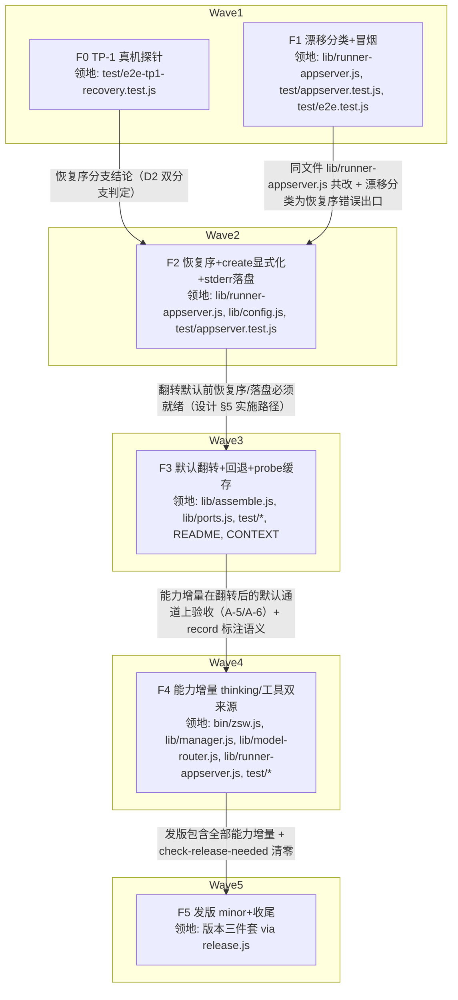

# zsw appserver 主通道化 实施计划

基线: 225930d | 来源设计: [docs/design/zsw-appserver-promotion-design.md](zsw-appserver-promotion-design.md)（三轮对抗式审查通过，must_fix==0） | 日期: 2026-08-29

## 0 章节映射

| 内容 | 设计文档实际位置 |
|------|--------------|
| 背景/目标 | §1 背景目标（SCQA / 系统是什么 / 设计目标 G1-G6 表 / In & Out of scope） |
| 终态/机制 | §2 现状与问题分析；§3 解决方案（§3.1 终态使用者视角 / §3.2 方案对比 A-E / §3.3 关键决策 D1-D9） |
| 验收场景表 | §4 验收（A-1 ~ A-9 真机场景表，含场景/步骤/通过标准/回溯列） |
| 下一层拆分 | §5 下一层拆分（F0-F5 单元表 + 实施路径） |
| 待验证检查点 | §5 末「待验证检查点」3 条（TP-1 restoreWarning / 工具限制格式契约 / 背压+多会话恢复） |

审查证据：`/tmp/design-review-zsw-appserver-round2.md`（二审 1 must-fix + 8 suggestion）→ 已全部修复 → `/tmp/design-review-zsw-appserver-round3.md`（定向复审 9/9 fixed、新 must-fix 0、可定稿）。

## 1 目标快照（逐字摘录）

> **一句话结论**：把 zsw 的默认执行通道从「每轮 spawn 一个 zcode CLI 进程」翻转为「常驻 app-server（apc 协议）引擎」——与 ZCode GUI 底层同一架构；以「默认翻转 + 显式回退开关 + probe 降级链保留」控制风险，分四阶段交付（前置收口 → 默认翻转 → 能力增量 → 可选 workflow 接入），恢复序与协议漂移检测是两个硬前置。

设计目标：

| # | 目标（使用者体验倒推） | 判定标准 |
|---|------------------------|----------|
| G1 | 默认通道 = appserver：`zsw start` 不带任何 env 即走常驻引擎，任务与 conversation 续聊正常完成，冷启动开销消失 | record.runnerKind='appserver'；第二轮 send 无进程重建 |
| G2 | 断链自愈：空闲驱逐（引擎驻留池 10min）或进程崩溃后，conversation 下一次交互自动恢复或以诚实错误降级 | -32004 触发自动 resume 重试一次；不可恢复时报「会话弃用+重试指引」而非裸错误码 |
| G3 | 协议漂移可发现：ZCode 升级导致的协议不兼容被识别为「版本问题」并给出恢复指引，不伪装成普通任务失败 | -32601/-32602 分类为 protocol-drift；升级冒烟脚本本地手动一键可跑（CI 不含真机 e2e） |
| G4 | thinking 可调：`zsw start --thinking <level>` 生效且非法值容错 | 引擎 stderr 落盘（D3 新增实时落盘）thoughtLevel 命中；非法值 warn 跳过不失败 |
| G5 | apc 独有安全面接入：per-session 工具白/黑名单；隔离环境遥测关闭 | create 参数携带工具限制；子进程 env 无遥测标识写入 |
| G6 | 回退与可观测：`ZSW_RUNNER=spawn` 显式回退旧路径；probe 失败自动降级；每个任务如实标注实际通道 | 降级日志 + record.runnerKind 与实际一致 |

**In**：默认翻转与回退开关；恢复序；漂移检测与冒烟；thinking/工具限制/遥测接线；测试与文档翻转；发版判定。
**Out**：workflow 线接入 runner 端口（独立后续设计）；GUI 层重写 / v4 订阅面逆向；共享主 HOME（三次被否）；`session/setThoughtLevel` RPC 的任何使用。

## 2 单元列表

u-foundation 缺席说明：本项目 plain Node CJS 无跨单元共享类型/接口契约模块；唯一多单元共享文件 `lib/runner-appserver.js` 由 F1→F2→F4 串行边覆盖，无需独立契约根节点。

| Unit | 职责 | 领地（精确文件路径，均相对 `z-subagent-workflow/`） | 依赖 | 隔离 | 验收条款 |
|------|------|------|------|------|------|
| F0 | TP-1 真机探针（场景矩阵 A 驱逐/B 崩溃/C 多会话 + 四条排查候选），产出恢复序分支判定结论 | `test/e2e-tp1-recovery.test.js`（新增，e2e 前缀使 CI 天然排除） | 无 | plain | 脚本真机可重复执行；结论明确回答：驱逐线是否触发 restoreWarning、四条清除候选（send runtimeModel / create runtimeModel / updateRuntimeModelConfig / registry 等待）哪条可用；C 线给出多会话 -32031 连坐观察数据。结论写入脚本头注 + 本计划状态表证据指针，并据此判定 D2 双分支（全自愈 vs 驱逐自愈+崩溃诚实报错） |
| F1 | 协议漂移分类 protocol-drift + 升级冒烟脚本（probe 扩面）；A2/A4 假设收口 | `lib/runner-appserver.js`、`test/appserver.test.js`、`test/e2e.test.js` | 无 | plain | 单测：fake server 返回 -32601/-32602 时错误分类为 protocol-drift、record 与 stderr 双落点、错误信息含冒烟命令与 `ZSW_RUNNER=spawn` 回退指引；冒烟脚本（create + send 极小任务 + sessionId 路径/turn.terminal/response 非空/toolDenylist 生效断言）本地手动跑通；对应设计 A-7 |
| F2 | -32004 四步恢复序，**① 固化为 `session/resume {sessionId, runtimeModel}`（F0 实证最优：warning 根本不设置，驱逐/崩溃两类通吃；每次无条件携带——接种效应不可依赖，runtimeModel 构造器复用 F0 归档的 `buildRuntimeModel()`；registry 等待线已证伪删除）**；② 重挂订阅 ③ 重试 send ④ timeoutMs 窗口判据 + stop 清场 + 分支 B 兜底；runner 级恢复互斥（F0 C 线：串行化不解 -32031、防风暴面）；引擎 stderr 实时落盘 `~/.zcode/zsw/logs/`；create 显式化（persistence:immediate）；遥测 env；idle TTL 常量删除 | `lib/runner-appserver.js`、`lib/config.js`、`test/appserver.test.js` | F0（恢复序分支结论） | plain | 单测（fake server 驱动）：-32004→resume{runtimeModel}→重挂 subscribe→重试 send 链路、④ 超时→stop→分支 B、恢复互斥串行化、订阅重挂（缺则终态不达）均覆盖；create 携带 persistence:"immediate"；子进程 env 含 `ZCODE_MODEL_TELEMETRY_ENABLED=false`；stderr 实时写 `~/.zcode/zsw/logs/`；`lib/config.js:78` idleConversationTtlMs 删除且全仓 grep 无引用；对应设计 A-2a/A-2b 的单测面 |
| F3 | 默认翻转 + 显式回退 + probe 落盘缓存（含命中后首败失效重探）+ 测试/文档翻转；**README:103 idleConversationTtlMs 残留引用删除（F2 移交）** | `lib/assemble.js`、`lib/ports.js`、`test/assemble.test.js`、`test/e2e.test.js`、`README.md`、`CONTEXT.md` | F1、F2 | plain | `assemble.js:64-65`/`ports.js:130` 缺省翻转为 appserver，`ZSW_RUNNER=spawn` 显式回退；probe 结果落盘 `~/.zcode/zsw/probe-cache.json`（键=CLI 路径+mtime；只缓存 ok；命中后首次 create -32603/-32601/-32602 失效重探一次）；assemble.test.js 缺省断言反转 + 回退用例；e2e E1-E6/E8 显式钉 spawn、E7 升主链路；README（:99-103 重写+顺修+idle TTL 残留删除）/CONTEXT.md（补 ZSW_RUNNER）更新；翻转点为独立最小 diff 可回滚 |
| F4 | 能力增量：`--thinking`（readState 校验源缓存）+ 工具限制双来源（CLI flag + frontmatter disallowedTools → toolDenylist 并集；tools 白名单维持软约束）；record 标注；**record errorKind 透传**（`lib/manager.js` `_completeRun` transition patch 加一行 `errorKind: result && result.errorKind`——F1 blocker 移交，F1 已完成 runner 侧双落点但 record 独立字段需此透传） | `bin/zsw.js`、`lib/manager.js`、`lib/model-router.js`、`lib/runner-appserver.js`、`test/cli.test.js`、`test/manager.test.js`、`test/appserver.test.js` | F3 | plain | `zsw start --thinking low` 映射 create.thoughtLevel（readState.thoughtLevel.available 连接级缓存校验，非法值 warn 跳过不失败）；`--allow-tools/--deny-tools` 逗号分隔 → toolAllowlist/toolDenylist；`taskCtx.disallowedTools`（frontmatter）与 CLI deny 并集去重入 create.toolDenylist；不调用 session/setThoughtLevel；record 标注 thinking 实际档位（spawn 降级轮 thinking:null）；protocol-drift 错误以独立 errorKind 字段落 record；对应设计 A-5/A-6 单测面 |
| F5 | 发版与收尾：minor release + 发布说明（重启生效）+ skill/command 文档复核；**三个 F4 移交项**：① `lib/ports.js` JSDoc 契约同步（TaskCtx thinking/toolAllowlist/toolDenylist、RunResult thinking/errorKind、prepareRunEnv 第三参 sessionOpts——纯注释）；② `dist/mcp/server.js` zsub tool inputSchema 补 thinking/allow-tools/deny-tools 三参数声明（MCP 面 1.0.0 起离线，socket handler 直通 manager 已生效，仅 schema 声明缺）；③ README「tools 白名单软约束/denylist 硬约束」表述按 D6 来源②接线后事实翻转（两通道均引擎级硬拦截，白名单维持软约束） | 版本三件套（`package.json`、`.zcode-plugin/plugin.json`、根 `marketplace.json`，经 `scripts/release.js`）；`lib/ports.js`（仅 JSDoc）；`dist/mcp/server.js`（仅 inputSchema）；`README.md`（仅该条目）；发布说明随 tag | F1-F4 | plain | `node scripts/release.js z-subagent-workflow minor` 完成三处版本同步 + commit + tag（不 push，push 另行授权）；仓根 `node scripts/check-sync.js`、`node scripts/check-pack.js` 绿；`node scripts/check-release-needed.js` 对本插件清零；发布说明含「重启 ZCode 生效」与升级冒烟指引 |

## 3 DAG 图

波次：W1={F0,F1}（领地互斥可并行）→ W2={F2} → W3={F3} → W4={F4} → W5={F5}。全 plain（无热点公共文件并行共改、非实验性大改、用户未指定 worktree）。

## 4 测试策略

测试命令真实来源：项目 AGENTS.md「插件目录内 node --test test/」；`package.json` 无 scripts 字段（1.1.0，CJS，node>=20）。

| 类型 | 命令（cwd=`z-subagent-workflow/`） | 用途 |
|------|------|------|
| 增量单测（单元开发期） | `node --test test/appserver.test.js`（F1/F2/F4）、`node --test test/assemble.test.js`（F3）、`node --test test/cli.test.js test/manager.test.js`（F4）、`node --test test/config.test.js`（F2） | 每单元 dev→fix 循环的绿门 |
| 真机探针（F0） | `node --test test/e2e-tp1-recovery.test.js`（真实 app-server 进程，注意 token 消耗） | F0 验收；不进常规循环 |
| 全量（收尾/阶段5） | `node --test test/`（含真实模型 e2e，约 3.5 分钟 + token） | Gate A；收尾场景才跑 |
| 一致性（仓根） | `node scripts/check-sync.js`、`node scripts/check-pack.js`、`node scripts/check-release-needed.js` | F5 与 pre-commit 版本拦截 |

单测中的协议交互一律 fake server（内存 NDJSON mock），不触真实模型；真机面归 F0 探针与阶段 5 验收。

## 5 合理偏差登记表

| 日期 | 单元 | 偏差 | 裁决理由 | 设计侧动作 |
|------|------|------|----------|------------|
| 2026-08-29 | F1 | record 的 errorKind 独立字段透传（manager._completeRun 固定字段集不透传）移交 F4 | F4 领地本含 manager.js 与 record 标注验收；F1 runner 侧双落点已完成 | 计划 F4 单元行已补职责 |
| 2026-08-29 | F1 | A4 真机实测牵出 extractAssistantText 对真实 read 形态失效的修复 + 新增 extractReadUsage（原被 payload.response 帧兜底掩盖） | 设计头注 A4 预留单点（「→ 只改 extractAssistantText()」）的收口职责；新旧双形态单测钉住；顺带沉淀 settings.thoughtLevel 随 read 应答可见（F4 直接消费） | 无需改设计文档；lib 头注 A2/A4 已由 F1 更新为收口结论 |
| 2026-08-29 | F0 | 排查候选②落地形态修正：create 带 runtimeModel → `session/resume {sessionId, runtimeModel}`（resume params 原生含该字段，create 是新会话面与恢复无关） | 源码 + 真机双证；候选清单意图（恢复时应用模型配置）由 resume 形态承接 | 设计文档 D2/§2.2 事实 2 已按此回填 |
| 2026-08-29 | F0 | 驱逐加速手段：idleTimeoutMs 无 env/CLI/config 覆盖面（驻留池参数仅 GUI host 进程内注入），改用 high_water_lru 洪泛（16+ immediate 不订阅会话秒级触发真驱逐），保留 10min 真实等待回退（ZSW_TP1_FLOOD_ONLY 门控） | 源码证实无覆盖面；洪泛为真驱逐语义等价物 | 设计文档 §2.2 事实 1 已回填 |
| 2026-08-29 | F2 | -32010 出口细化：设计只写「不重试」；实现明确「恢复序重试 send 遇 -32010 = 恢复已成功，按 busy 如实上抛、不落分支 B」（落分支 B 会误报会话弃用），独立用例钉住 | 设计 D2 未覆盖此出口语义，实现选择与 busy 诚实语义一致 | 无需改设计（实现层语义，头注已沉淀）；一致性审查复核 |
| 2026-08-29 | F2 | README:103 仍引用 idleConversationTtlMs（F2 领地外），删除移交 F3 文档翻转面 | README 本就是 F3 领地 | F3 单元行已补 |
| 2026-08-29 | F3 | e2e 钉 spawn 采用文件顶部统一 `process.env.ZSW_RUNNER='spawn'`（一处声明覆盖 E1-E6/E8），未逐场景重复设置 | 等效于 D9「逐场景显式钉 spawn」，一处声明更可维护；E7/E10 显式注入不受 env 影响 | 无需改设计（实现形态等价） |
| 2026-08-29 | F3 | 缓存命中首败+重探失败的降级落地为「通道级降级」：本任务转 spawn 重跑 + records 改标 + wrapper.capabilities() 翻转，daemon 生命周期内后续任务走 spawn 免重探（重启即恢复探测） | 设计 D1 只写「降级 spawn」，未指明任务级/通道级；通道级避免每任务重复付「撞错→重探→失败」成本，且 daemon 重启自然回探 | 一致性审查复核该语义（后续任务静默 spawn 需 stderr 出声一次） |
| 2026-08-29 | F4 | thinking 校验源两级：优先 session/read 应答 settings.thoughtLevel 顺带沉淀（F1 实测面），无缓存退 workspace/readState（params 形态无实测记录，按最小空 params 发起，任何失败缓存「不可用」+ 透传档位给引擎 P2 容错兜底） | 设计 D5 只写「readState 校验源」，read 顺带沉淀是 F1 新发现的面（更省一次请求）；真机校准单点收敛在 runner-appserver._resolveThinking | A-5 真机验收时校准；一致性审查复核 |
| 2026-08-29 | F4 | record.thinking 标注矩阵细化：生效=档位字符串；非法跳过=null；spawn 通道请求了='null (spawn 降级)'（设计字面）；未请求=不落字段；resume 轮不改写首轮标注（thinking 会话级驻留，续聊无 create 面）；「不改写」用条件携带键实现（record-store 内存 fold 的 Object.assign 会用 undefined 覆盖，行为事实沉淀 manager.js 头注） | 设计只给 spawn 降级字面；矩阵与 Object.assign 行为是实现层必要语义 | 无需改设计；一致性审查复核 |
| 2026-08-29 | F5 | TaskCtx JSDoc 补字段超出任务点名清单（多补 runEnv 与 disallowedTools）——「以 lib 实际实现为准逐字段核对」的产物（manager.js:233-239 组装、两 runner 均消费，原 JSDoc 缺失） | 领地内（ports.js 仅 JSDoc）；契约完整性 | 无 |
| 2026-08-29 | F5 | 观察项（未改，不在领地）：model-router.js:235 runnerKind JSDoc 缺省注释仍写 'spawn'（F3 翻转后未同步）；实际调用方恒显式传，无行为影响 | 纯注释漂移，无行为面 | 随下次触及 model-router.js 的单元顺修；一致性审查登记 |
| 2026-08-29 | 修复批次 | 检查点 2（spec 形态实测）改记归 A-6 真机收口：不为冒烟增加 token 成本（升级后高频操作保持极小），E9 仅保留参数面无漂移断言，行为面验证归一次性验收场景 A-6 | 冒烟 token 成本 vs 一次性验证；设计文档检查点 2 已同步改记 | 设计文档已改记 |
| 2026-08-29 | 修复批次 | 区 B 观察项不修裁决：降级重跑 `await runSpawnRound` 秒级窗口内 cancel 丢失（终态仍落盘不悬挂，仅 cancel 语义弱化） | 窗口极窄 + 无悬挂后果，修复属过度工程 | 登记为已知边界；后续若报告实际影响再修 |

## 6 状态表

| Unit | 状态(pending/in-progress/committed/blocked) | 轮次 | 证据指针 |
|------|------|------|------|
| F0 | committed | 1 | 探针归档 `test/e2e-tp1-recovery.test.js`（头注含全部结论）；真机三线一次全绿（A 22.7s/B 37.6s/C 30.1s）；结论已回填设计文档 §2.2 事实 1/2、D2、§5 检查点 1/3；无门控默认 skip 3 场景（CI 安全）复验 |
| F1 | committed | 1 | commit（本轮）；单测 36/36、全量非 e2e 358/358 复跑绿；真机 apc-smoke pass（token 1 次调用）；A2/A4 收口，A4 牵出提取链修复（见偏差登记表） |
| F2 | committed | 1 | commit（本轮）；单测 50/50、全量非 e2e 372/372 复跑绿；恢复序全链/互斥/④窗口/分支 B/persistence/遥测 env/stderr 落盘全覆盖；idle TTL 声明已删（仅剩注释） |
| F3 | committed | 1 | commit（本轮）；assemble 12/12、全量非 e2e 380/380 复跑绿；真机最小验证：默认通道 runnerKind='appserver' + probe-cache 命中跳探 + ZSW_RUNNER=spawn 回退三连过；真机抓出并修复 resolveCliPath 引用 bug（config.ZCODE_CLI 非 DEFAULTS.ZCODE_CLI） |
| F4 | committed | 1 | commit（本轮）；增量 106/106、全量非 e2e 395/395 复跑绿；setThoughtLevel 零调用核实；thinking 双级校验源/工具双来源并集/errorKind 透传全覆盖；A-5/A-6 真机归阶段 5 |
| F5 | committed | 1 | 收尾三移交项 commit（本轮）+ release.js minor 发版（见下）；server.test.js 31/31、check-sync/check-pack 绿、三件套 1.1.0→1.2.0；发布说明全文见本计划 §8 |

## 7 残留风险与变更历史

残留风险（承接设计 §5 检查点与复审 INFO）：
1. F0 结论可能判定崩溃分支不可自愈（-32031 无解）→ D2 走分支 B（驱逐自愈 + 崩溃诚实报错），不阻塞翻转（设计已预案）。
2. 工具限制 spec 形态（`Bash(git *)`）支持性待 F1 冒烟实测；先按裸工具名落地。
3. stdio 背压 + 多会话并发恢复（A-8/F0 C 线）为观察项非阻塞门。
4. 复审 INFO×2（实施期留白）：D2 ④ 失败场景的分支 B 文案措辞需适配「事件流不可达」语义（F2 已按此实现）；D1 缓存重探 ok 后的重试动作由 D3 漂移分类兜底（F3 已按此实现）。
5. F3 观察项（非 F3 引入，阶段 5 观察）：`--local` CLI 进程任务 closed 后偶发收尾慢（5 次真机 1 次，最终 exit 0）——F3 未改 runner/CLI 收尾逻辑，如需根治属独立问题。
6. README「tools 白名单软约束/denylist 硬约束」条目翻转后仍真（F4 frontmatter 接线后再更新表述，F5 复核）。

| 日期 | 事件 |
|------|------|
| 2026-08-29 | 计划创建（设计文档自 /tmp 归位 docs/design/；DAG 沿用设计 §5 F0-F5，F0 领地精确化为新文件 test/e2e-tp1-recovery.test.js） |
| 2026-08-29 | F0 探针结论回填设计文档（D2 固化 resume{runtimeModel}、双分支划分不成立）；F2/F3/F4 期间新增移交项与偏差均记入 §5 |
| 2026-08-29 | W1-W5 全部 committed；F5 发版 1.2.0（tag z-subagent-workflow@1.2.0，未 push） |

## 8 发布说明（z-subagent-workflow 1.2.0，随 tag 分发）

### 默认执行通道翻转为 appserver（常驻引擎）
- `zsw start` 不带任何 env 即走常驻 `zcode app-server` 引擎（与 ZCode GUI 底层同架构）：每轮 1-2s 的冷启动开销消失，conversation 续聊零进程重建。
- 断链自愈：会话被引擎回收（空闲驱逐或引擎进程崩溃）后，下一次交互自动 `session/resume`（携带 runtimeModel）重试一次；不可恢复时报「会话弃用 + `zsw start` 重建指引」，不再是裸错误码。
- 协议漂移防线：ZCode 升级改了 apc 协议时，相关错误被分类为 protocol-drift 并附恢复指引，不伪装成普通任务失败。

### 回退开关
- `ZSW_RUNNER=spawn` 显式回退旧通道（每轮独立 zcode 进程，行为与翻转前一致）。注意：daemon 在进程启动时读一次 env——修改该变量后需重启 ZCode 生效。
- probe 健康检查失败自动降级 spawn（结论落盘 `~/.zcode/zsw/probe-cache.json`，只缓存成功结论，CLI 更新即失效重探）。降级为**通道级**：daemon 生命周期内后续任务直接走 spawn 免重探；重启 ZCode 后恢复探测。

### 新参数：--thinking / --allow-tools / --deny-tools
- `zsw start --thinking <low|high|max>`：appserver 通道映射会话思考档位（合法值按模型动态，GLM 默认 max；省预算场景显式传 low）。非法档位 warn 跳过，任务不失败。
- `--allow-tools <逗号分隔裸工具名>` / `--deny-tools <逗号分隔裸工具名>`：per-session 工具白/黑名单（appserver 通道引擎级生效）。

### agent .md 工具黑名单升级为引擎级拦截
- frontmatter `disallowedTools` 在 appserver 默认通道同样走引擎级硬拦截（与 CLI `--deny-tools` 并集去重），与原 spawn 通道 `--disallowed-tools` 行为等价。
- frontmatter `tools` 白名单维持 prompt 软约束（两通道一致）。

### 升级 ZCode 后的冒烟指引
apc 协议无版本协商，ZCode 升级后建议本地手动跑一次冒烟（含真实模型调用，注意 token 消耗）：

    cd <插件目录> && node test/e2e.test.js --name apc-smoke

出现 protocol-drift 错误时按错误信息指引核对漂移面；确认不兼容期间设 `ZSW_RUNNER=spawn` 回退（重启 ZCode 生效）。

### 已知边界
- spawn 回退通道（含 probe 降级轮）thinking 与工具限制均不可用——请求了会在 record 中如实标注（thinking: `null (spawn 降级)`；tools: `null (spawn 降级：工具限制未生效)`）。
- daemon 进程启动时读一次 env：任何 `ZSW_RUNNER` / `ZSW_ZCODE_CLI` 变更需重启 ZCode 后生效。
- 通道级降级后 daemon 生命周期内后续任务走 spawn 免重探，重启 ZCode 恢复探测。
