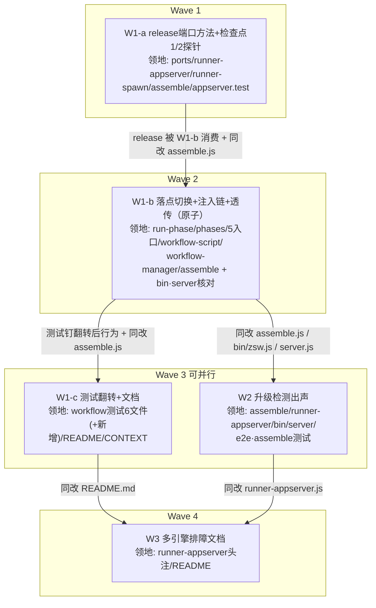

# zsw apc 第二波优化 实施计划

基线: 9d24633 | 来源设计: [zsw-appserver-wave2-design.md](zsw-appserver-wave2-design.md) | 日期: 2026-08-30

- 工作区：`/Users/zhushanwen/Code/zcode-plugin-workspace/feat-app-server-refactor`（分支 `feat-app-server-refactor`）
- 代码根（所有领地路径此前缀）：`z-subagent-workflow/`
- 审查证据：三轮对抗式审查收敛 4→1→0 must-fix，round-3 判定「达可实施状态」（报告 `/tmp/design-review-zsw-wave2-round{1,2,3}.md`，设计 §6 变更历史三行对应）
- 测试框架：**node 内置 test runner**（`node --test`，非 vitest）；全量 `node --test test/` 含真实模型 e2e（约 3.5 分钟）

## 0 章节映射

| 内容 | 本文实际位置 |
|------|--------------|
| 背景/目标 | §1 背景目标（SCQA / 系统是什么 / 设计目标 G1-G8 / In·Out of scope） |
| 终态/机制 | §3 解决方案（§3.1 终态四路径 / §3.2 方案对比 A-D / §3.3 关键决策 D1-D6）+ §2.4 物理数据流 |
| 验收场景表 | §4 验收（B-1 ~ B-9，含场景/步骤/通过标准/回溯列） |
| 下一层拆分 | §5 下一层拆分（W1-a / W1-b / W1-c / W2 / W3 单元表 + 实施路径） |
| 待验证检查点 | §5 末「待验证检查点（实施期门）」1-4（⛔ 1/2/4；✅ 3 已登记） |

## 1 目标快照（逐字摘录）

> **一句话结论**：把 workflow 线的阶段执行从「每阶段 spawn 独立 zcode 进程」接入第一波建成的 RunnerPort（默认走常驻 app-server，冷启动从「每阶段 1-2s」降为「每 workflow 至多一次」），为此必须新增一次性会话的 release 语义（订阅会话免驱逐，不 close 会让引擎驻留池单调膨胀）；另含两个独立的小型硬化单元——ZCode 升级检测出声（漂移发现时机从「任务失败」提前到「升级后首次组装」）与多引擎共存排障文档化。

**设计目标（判定标准列摘录）**：

| # | 目标 | 判定标准 |
|---|------|----------|
| G1 | workflow 默认走 apc | 阶段条目 sessionId 为 apc 会话形态；同 workflow 第二阶段起引擎日志无新进程启动行 |
| G2 | 混跑不串线 | 3 视角 parallel workflow + 1 个 zsub 任务同时跑，全部完成、响应不串线 |
| G3 | 中止/超时可操作 | abort 后引擎 `session/list` 无该会话 running 轮；报告 `status:'aborted'`；timeout 条目 `timedOut:true` 两通道同形态 |
| G4 | 降级链同构 | `ZSW_ZCODE_CLI` 指向坏路径后 workflow run 仍完成，stderr 见降级日志 |
| G5 | 引擎崩溃诚实 | kill 引擎后在飞阶段条目 ok:false 带原因；不重启 daemon 直接再 run，自动重建并完成 |
| G6 | 一次性会话不驻留 | 引擎自有日志可见各阶段 close 帧；close 后 send 撞 -32004 由检查点 1 探针钉死；persistence 面跨进程 list/read 可读可恢复 |
| G7 | 嵌套防护两闸门等价 | 阶段会话内 prompt 诱导 bash 调 `zsw start`/`zflow` 被拒 |
| G8 | 升级可发现提前 | 模拟 CLI mtime 变化后：CLI 命令 stderr 与 zflow 结果均出现提示；跑通冒烟后提示消除 |

**Out of scope**（明确不做）：zsub 线任何改动；workflow 的 thinking/工具限制 flag 面；漂移冒烟 CI 化；多引擎共存 holder 锁；单进程多会话连坐面与 stdio 背压；spawn 通道删除；zsw 1.2.0 发布流程本身。

## 2 单元列表

| Unit | 职责 | 领地（`z-subagent-workflow/` 前缀） | 依赖 | 隔离 | 验收条款 |
|------|------|------|------|------|----------|
| W1-a | RunnerPort 加 `release(exec)`：apc = session/close（控制面 1.5s best-effort）+ `_sessions` 注销；spawn = no-op；`exec.sessionId` 未回填 no-op。`wrapWithProbeInvalidation` 包装层按 `exec.kind` 转发 release。**先跑检查点 1 探针**（同一连接 create→subscribe→close 后 ①同连接 send 撞 -32004 ②read 仍可读 ③引擎日志 close 帧 ④close 态 resume 应答无错误码），按结论定实现形态（含两档降级）；附带检查点 2 探针（highWater=16 之上订阅会话行为），结论不阻塞 | lib/ports.js、lib/runner-appserver.js、lib/runner-spawn.js、lib/assemble.js、test/appserver.test.js | 无 | plain | ① 探针 1 四分支结论记录在案（①-④ 逐项判定；不成立项按 D2 降级并上报，主 agent 回填设计文档）② test/appserver.test.js 新增 release 单测绿：close 调用与超时 best-effort、sessionId 未回填 no-op、包装层按 kind 路由转发（fromCache 路径 release 非 undefined）③ `node --test test/appserver.test.js test/assemble.test.js` 绿 |
| W1-b | **原子单元（设计 §5：拆开则中间态 run-phase 持 undefined runner 全线 TypeError）**：① run-phase 切 RunnerPort 三行范式（`capabilities().kind` → `prepareRunEnv(modelRef, kind)` → `runner.start`；abort 双检查窗口在「kind 读取/prepareRunEnv 之后、runner.start 之前」原样保留两点；abort 从 `run.cancel()` 改 `handle.cancel()`；条目加 `channel` 字段；done 落定后全终态 `runner.release?.(exec)` best-effort）② runner 透传链（WorkflowManager 构造注入 → `_invokeEntry` 挂 plan/opts → workflow 入口 → phases.runPhase → run-phase；workflow-script.js 脚本 ctx 同链；signal 同构先例）③ assembleManager 注入包装后 runner 实例；bin/zsw.js 与 dist/mcp/server.js 构造点核对（预期零改动——注入在 assemble 内部完成）④ 检查点 4 探针：abort 在飞会话后引擎 jsonl 的可辨识帧形态，不成立则 B-3 判据降级并上报 | lib/workflow/run-phase.js、lib/workflow/phases.js、lib/workflow/chain.js、lib/workflow/parallel.js、lib/workflow/map-reduce.js、lib/workflow/scatter-gather.js、lib/workflow/review-fix-loop.js、lib/workflow-script.js、lib/workflow-manager.js、lib/assemble.js、bin/zsw.js（核对）、dist/mcp/server.js（核对） | W1-a | plain | ① 既有 workflow 线测试全绿（行为不回归，领地内测试集见 §4）② 新增 fake-runner 单测绿：三行范式走 start、abort 双检查窗口两处、条目 channel 字段、全终态调 release ③ `node --test test/` 全量绿（翻转点跑全量，~3.5 分钟）④ 检查点 4 探针结论记录在案 |
| W1-c | 测试翻转：既有 workflow 用例钉「spawn 显式回退」（ZSW_RUNNER=spawn 或 fake spawn runner），新增 apc 主链路用例（fake runner，不花 token）；README 已知边界重写（CLI 本地 run 每 workflow 一次引擎惰性启动 ~1-2s / CLI 本地形态 abort 为进程级语义）；CONTEXT.md env 面 | test/workflow-a.test.js、test/workflow-b.test.js、test/workflow-base.test.js、test/workflow-manager.test.js、test/workflow-script.test.js、test/review-fix-loop.test.js、（可新增 test/workflow-apc.test.js）、README.md、CONTEXT.md | W1-b | plain | ① 既有用例显式钉 spawn 回退且绿 ② 新增 apc 主链路用例绿 ③ `node --test test/` 全量绿 ④ B-9 CLI 臂真机验收：坏路径降级完成 + stderr 降级日志 + 条目 channel 如实；`ZSW_RUNNER=spawn` 对照行为不变 |
| W2 | 升级检测出声：`resolveRunnerKind` 区分 miss 类型（「无该 CLI 条目」= 首次静默 /「有条目但 mtime 不匹配」= 升级）落 `~/.zcode/zsw/upgrade-notice.json`（`{cliPath, mtimeMs, detectedAt}` 原子写与 probe 缓存同款）；**恢复 DRIFT_SMOKE_CMD / DRIFT_FALLBACK_ENV 导出**（79577a0 已移除，恢复前 lazy require 拿到 undefined）；CLI 任意命令执行前查标记 stderr 出声；zsub/zflow MCP tool 结果尾部追加；apc-smoke 通过后删除标记 | lib/assemble.js、lib/runner-appserver.js（恢复导出）、bin/zsw.js、dist/mcp/server.js、test/e2e.test.js（apc-smoke 清除点）、test/assemble.test.js | W1-b | plain | ① test/assemble.test.js 新用例绿：miss 类型区分、标记原子写、冒烟通过清除语义、DRIFT 常量导出可 require ② B-8 CLI 臂真机验收：touch mtime → CLI stderr 提示 → 冒烟通过后标记删除提示不再出现 ③ `node --test test/assemble.test.js` 绿 |
| W3 | 多引擎容忍面文档：runner-appserver.js 头注补「同 HOME 多引擎是设计内容忍面」断言（依据：写盘原子 + SQLite 多进程容忍 + 会话各建各的；约束未来改动：跨会话操作提案须先单引擎化）；README 排障节加条目：`lsof ~/.zcode/zsw/home-appserver/.zcode/cli/db/db.sqlite` 定位法（argv 无 HOME、pgrep 恒不匹配）+ 判读规则（短暂态 vs 残留 kill，数据不丢） | lib/runner-appserver.js（仅头注）、README.md | W1-c、W2 | plain | ① 头注断言含容忍依据与单引擎化前置约束 ② README 排障节含 lsof 定位法 + 判读规则 ③ `node --check lib/runner-appserver.js` 语法绿 |

## 3 DAG

领地交集审计（全部被串行边覆盖）：assemble.js ∈ {W1-a→W1-b→W1-c, W2}；runner-appserver.js ∈ {W1-a, W2, W3}（W1-a→W1-b→W2→W3 传递覆盖）；README.md ∈ {W1-c, W3}；bin/zsw.js·dist/mcp/server.js ∈ {W1-b, W2}。Wave3 内 W1-c 与 W2 领地互斥（测试文件集不相交：workflow 6 文件 vs e2e/assemble 2 文件）。

## 4 测试策略

框架：node 内置 test runner。**全部命令 cwd = `z-subagent-workflow/`**。

| 面 | 命令 | 用途 |
|----|------|------|
| W1-a 增量 | `node --test test/appserver.test.js test/assemble.test.js` | release 单测 |
| W1-b 增量（workflow 线测试集） | `node --test test/workflow-a.test.js test/workflow-b.test.js test/workflow-base.test.js test/workflow-manager.test.js test/workflow-script.test.js test/review-fix-loop.test.js test/manager.test.js test/execution.test.js test/cli-workflow-daemon.test.js test/appserver.test.js test/assemble.test.js` | 翻转不回归 |
| W1-b / W1-c 全量 | `node --test test/`（~3.5 分钟，含真实模型 e2e） | 翻转点 + 收口 |
| W2 增量 | `node --test test/assemble.test.js` | 升级检测单测 |
| W2 真机冒烟 | `node test/e2e.test.js --name apc-smoke` | B-8 清除语义（花少量 token） |
| W3 语法 | `node --check lib/runner-appserver.js` | 头注改动 |
| Gate A 全量 | `node --test test/` | 收尾门 |
| Gate B 真机场景 | B-1 ~ B-9 逐行签收（见 §5 分层：CLI 可达臂单元期跑；daemon/MCP 臂 Gate B 用户协同） | 验收门 |

真机场景分层（B 表全部落在 Gate B 签收，CLI 可达臂提前到单元期）：

- 单元期可跑（CLI 臂）：B-1（chain 默认通道）、B-4（超时两通道）、B-5（kill 引擎重建）、B-9（坏路径降级 + spawn 对照）、B-6①（引擎日志 close 帧）、B-7（嵌套诱导）、B-8①（CLI stderr）
- Gate B 用户协同（daemon/MCP 形态）：B-2（daemon 臂并发 + 对照臂双终端）、B-3（zflow abort）、B-8②（MCP 结果尾部）——需 zcode 会话内调 zflow/zsub

探针脚本纪律：检查点 1/2/4 探针为临时脚本，dev 收尾前清理不入库；探针结论由 dev 在返回结构 test_evidence 中给出，需回填设计文档的由主 agent 执行（doc 变更记 §6 变更历史）。

## 5 合理偏差登记表

初始为空。执行期发现的合理不一致（含领地微调、行号漂移、措辞修正）在此登记，必要时同步设计文档。

| 日期 | 单元 | 偏差 | 理由 | 处置 |
|------|------|------|------|------|
| 2026-08-30 | W1-a | 检查点 1 判据②③观测面修正（read 是 active 内存面方法非持久化面；引擎不为 session/close 写专属日志事件） | 探针四轮迭代实测：对照组（未 close 会话跨进程 read 同样 -32004）分辨出判据形态错误而非 close 语义错误；persistence 保留由 list/SQLite/resume→read 三面实证 | doc_errors：主 agent 已回填设计文档（G6/B-6/检查点 1/§6 变更历史五处），D2 两档降级均不触发，release 按原设计实现 |
| 2026-08-30 | W1-a | 附带发现（非本单元领地，备查）：生产 buildRuntimeModel 的「会话登记无 model 时回退 v2 model.main」兜底在本机不可用（v2 config 无 model 键，兜底 throw） | 探针期间发现；仅影响登记缺失的幽灵恢复场景，zsub 线会话登记恒带 model 不受影响 | 登记备查，本波不动代码；后续如需修复另立单元 |
| 2026-08-30 | W1-a | dev 实现三偏差（均采纳）：① shutdown 内联 close 超时 1_500 改引用 RELEASE_CLOSE_TIMEOUT_MS 常量（值不变，单一事实源）② assemble.js 新增导出 wrapWithProbeInvalidation（包装层转发面直测的最小通路）③ 既有契约签名用例方法列表加 release（回归钉） | ① 同语义防字面量漂移 ② 不导出则只能全组装间接覆盖，断言力不足 ③ 契约面新增方法不同步会变过时断言 | 合理偏差固化；release 内部顺序选「先注销再 close」（close await 期推送帧按 A2 宁丢勿错丢弃，close 失败注销不回退） |

## 6 状态表

| Unit | 状态 | 轮次 | 证据指针 |
|------|------|------|----------|
| W1-a | committed | 1 | <W1-a commit 后回填>（测试 75/75 绿；探针 1/2 结论已回填设计文档） |
| W1-b | pending | 0 | — |
| W1-c | pending | 0 | — |
| W2 | pending | 0 | — |
| W3 | pending | 0 | — |

## 7 残留风险与变更历史

### 风险与已裁决偏差

1. **W1-b 领地 12 文件，超全局 subagent「≤5 文件」约束**（W2 为 6 文件同类）。裁决理由：设计 §5 经三轮审查的原子性论证——执行落点与注入链拆批合入会产生「run-phase 已切端口但无人注入 runner」的破产中间态；12 文件中 7 文件为 ≤3 行机械透传（signal 同构先例）、2 文件为预期零改动核对、实质改写集中于 run-phase.js / workflow-manager.js / assemble.js；派发时 dev task 按文件逐个给精确改动点控制认知面。**此偏差需用户评审确认。**
2. 检查点 1 探针结论可能改变 release 实现形态（D2 两档降级）→ W1-a dev 上报后主 agent 改设计文档并记变更历史，不静默吸收。
3. daemon/MCP 形态验收（B-2 daemon 臂 / B-3 / B-8②）需 zcode 会话内协同，Gate B 用户参与，不阻塞单元推进。
4. 真机面（apc-smoke、B 场景、检查点 4 小 prompt）花少量 token，已按最小面设计。
5. 一波遗留（zsw 1.2.0 未发布、分支未合 main）不属本计划范围；本波完成后与本波改动一并走合流。

### 变更历史

| 日期 | 变更 | 触发 |
|------|------|------|
| 2026-08-30 | 初版（W1-a/W1-b/W1-c/W2/W3 五单元四波；W1-b 原子单元 12 文件偏差登记待用户确认） | dev-flow 阶段 1 |
