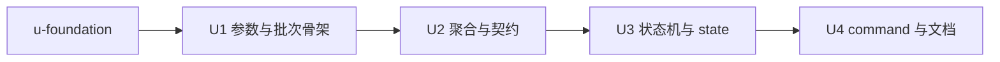

# zsw review-fix-loop v2 实施计划

基线: 本 commit | 来源设计: docs/design/zsw-review-fix-loop-v2-design.md（定稿 47719dc，must-fix 清零） | 日期: 2026-08-29

> 用户授权记录：用户显式指示「完成审查和修复问题后，直接进入开发，不用我来确认」——本计划跳过 plan.md 的用户评审门，直接基线开工。DAG/单元切分源自设计 §5 并经对抗式审查确认。

## 0 章节映射

| 内容 | 设计文档实际位置 |
|------|-----------------|
| 背景/目标 | §1 背景目标（SCQA、目标表 G1-G7、In/Out of scope） |
| 终态/机制 | §2.3 物理数据流；§3.1 终态（CLI 样例+失败路径表）；§3.2 方案对比；§3.3 决策 D1-D10；§3.4 接口与数据模型（CLI 参数面/reviewer/聚合/fixer 契约/state 字段/terminated 权威源/abort 检查点/ID 对齐/escalate 映射/aggregator-failure 触发） |
| 验收场景表 | §4（S1-S8 场景表 + §4.1 v1→v2 行为差异清单） |
| 下一层拆分 | §5（U1-U4 单元表 + 待验证检查点 3 条 + 发版 minor） |
| 待验证检查点 | §5「待验证检查点」（reconciliation 遵循率/聚合提取率/commands 字段双形态） |

所有 subagent task 的坐标从本表取，禁止自猜编号。

## 1 目标快照（摘录自设计 §1，逐字）

设计目标（使用者体验倒推）：

| # | 目标 | 使用者体验 |
|---|------|-----------|
| G1 | 审查噪声被裁决消化 | 臆测/无证据条目在聚合时降级，不进修复队列，不浪费 fix 轮次 |
| G2 | 修复效果可对账 | R2 起每条上轮 issue 有 fixed/not-fixed/regressed 判定，复发即升级处理 |
| G3 | 前置依赖可表达 | 静态检查等前置批次先跑完，后续审查批才有意义 |
| G4 | 过程可观测 | run 目录有 state.json + 各轮报告，结束后可回答「每轮发生了什么、为什么终止」 |
| G5 | 参数面与 pi 一致 | pi 用户零学习成本（stuckThreshold/converge*/maxFixAttempts 等同名同默认值） |
| G6 | 老调用参数兼容 | 老命令行（--reviewers/--review-target）仍被接受、正常完成出报告；语义差异有清单可查（见 §4.1） |
| G7 | 入口可发现 | GUI 里 /zsw 命令引导到编排 skill |

Out of scope（不做）：fixAgent 与 agentRef systemPrompt 注入（待无头 CLI 参数探针）；thinkingLevel/usage 透传；内置 agent 角色集；workflow 脚本 parallel/pipeline 原语；scores 打分 rubric；GUI 面板类。

## 2 单元列表

| Unit | 职责 | 领地（精确文件路径，均在 z-subagent-workflow/ 下） | 依赖 | 隔离 | 验收条款 |
|------|------|------|------|------|----------|
| u-foundation | vendor 14 个纯函数（从 pi 仓 review-fix-loop-utils.cjs 复制适配：剥离宿主耦合、'use strict'、CJS 导出）+ 契约常量（severity 集合/状态枚举/终态枚举）+ 单测 | `lib/workflow/review-fix-loop-utils.js`（新）、`test/review-fix-loop-utils.test.js`（新） | 无 | plain | node --test test/review-fix-loop-utils.test.js 全绿；14 函数导出齐；零 require 外部依赖（node 内置除外） |
| U1 参数与批次骨架 | CLI 参数面全集+白名单校验+batchN/reviewers sugar+targetType/target+base 锁定+批次外环+跨批 skip+runId 注入（manager _invokeEntry + _finalize runDir） | `lib/workflow/review-fix-loop.js`、`lib/workflow-manager.js`、`bin/zsw.js`、`dist/mcp/server.js`、`test/workflow-b.test.js` | u-foundation | plain | 设计 §4 S1/S4/S7 对应单测断言（批次时序用 state rounds 时间戳、跨批 skip 用 agents[] 记录、老参数 sugar 映射）；workflow-b 全绿 |
| U2 聚合 phase 与输出契约 | reviewer 契约扩展（suggestion_count/reconciliation）+parseFail/runFail 语义（D3）+LLM 聚合 phase+JS 降级链（D1 fallback 规格）+ID 对齐双路径同规+wrapUntrusted 全通道防注入（D10） | `lib/workflow/review-fix-loop.js`、`test/workflow-b.test.js`（可新增用例文件） | U1 | plain | 设计 §4 S2/S3/S8 对应单测断言（降级条目不进 fix 队列、对账转换链、fallback 轮 degraded 标记+ID 沿用）；workflow-b 全绿 |
| U3 对账/收敛状态机 + state 落盘 | 状态机接线（reconcile/convergence/needsRedesign/dormant/knownRemaining）+fixer 契约硬校验+state.json 原子写+修复范围全等级+fallowScan/autoCommit+escalate 映射 | `lib/workflow/review-fix-loop.js`、`lib/workflow/review-fix-loop-utils.js`（如需适配层）、`test/workflow-b.test.js` | U2 | plain | 设计 §4 S3/S5 对应单测断言（fixed/regressed 转换、state 落盘可读、terminated 权威源）；workflow-b 全绿 |
| U4 /zsw command + 文档 | commands/zsw.md + plugin.json commands 字段 + README/SKILL.md 参数表 + §4.1 差异清单入 README | `commands/zsw.md`（新）、`.zcode-plugin/plugin.json`、`README.md`、`skills/zsub-zflow-orchestration/SKILL.md` | U1-U3 | plain | 设计 §4 S6（本地校验：manifest 字段/文件存在/格式对齐官方示例；GUI 冒烟留验收阶段）；check-sync/check-pack 绿 |

## 3 DAG

全串行理由：U1-U3 领地重叠（review-fix-loop.js 与 workflow-b.test.js），并行必冲突；U4 依赖参数面定稿。

## 4 测试策略

- 增量（单元开发期）：`cd z-subagent-workflow && node --test test/review-fix-loop-utils.test.js test/workflow-b.test.js`；涉及 manager/CLI/server 改动时加跑 `test/workflow-manager.test.js test/cli.test.js test/server.test.js`
- 全量（收尾阶段 5）：`cd z-subagent-workflow && node --test test/`（含真机 e2e，约 3.5 分钟；e2e 真机门按 README 验收手册执行）
- workspace 门禁：`node scripts/check-sync.js && node scripts/check-pack.js`（U4 后与收尾各跑一次）

## 5 合理偏差登记表

（空）

## 6 状态表

| Unit | 状态 | 轮次 | 证据指针 |
|------|------|------|----------|
| u-foundation | pending | 0 | — |
| U1 | pending | 0 | — |
| U2 | pending | 0 | — |
| U3 | pending | 0 | — |
| U4 | pending | 0 | — |

## 7 残留风险与变更历史

- 真机遵循率风险（设计 §5 待验证检查点 1/2）：R2 reconciliation 缺失率 >30% 或聚合 fallback 率 >20% 时按设计回改路径执行（D2 拆二次调用 / D1 加 few-shot），登记本表。
- U1 的 workflow-manager.js 改动（runId 注入）触及共享层：_invokeEntry 增字段对其他 4 个内置 workflow 无害（解构风格忽略多余字段，复审已核实），但 workflow-manager.test.js 必须随跑。
- 变更历史：2026-08-29 计划创建（基线本 commit）。
