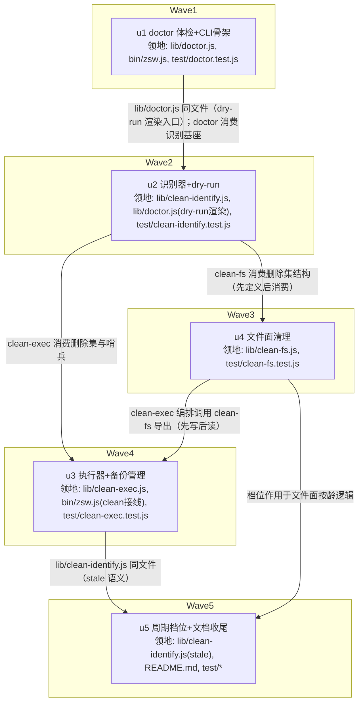

# zsw 会话残留清理 实施计划

基线: de120ee | 来源设计: docs/design/zsw-session-residue-cleanup-design.md | 日期: 2026-09-06

用户评审：用户已在任务指令中显式豁免（「开始开发，不用经过我确认」）——切分/验收条款按本计划执行，偏差走 §5 合理偏差登记表。

## 0 章节映射

| 内容 | 设计文档实际位置 |
|------|------------------|
| 背景/目标 | §1 背景目标（SCQA + G1-G4 + in/out-of-scope） |
| 终态/机制 | §3 解决方案（§3.1 终态 CLI 示例 / §3.3 决策 D1-D7 / §3.4 已接受代价 / §3.5 运行时断言与探针 P1-P4） |
| 验收场景表 | §4 验收（A-1..A-7，含步骤/通过标准/回溯列） |
| 下一层拆分 | §5 下一层拆分（F1-F6） |
| 待验证检查点 | §5「待验证检查点（实施期门）」① P3 停机探测 ② P4 引擎容错 ③ log 按龄与写入句柄；§3.5 P1/P2 已实证 |

对抗式审查通过证据：`.review/zsw-residue-r4.md`（主审 0 must-fix + 3 suggestion，已当轮修完）、
`.review/zsw-residue-r4-impact.md`（影响面审 0 must-fix + 2 suggestion，已当轮修完）；完整四轮轨迹
R1(6M+7S)→R2(4M+6S)→R3(2M+5S)→R4(0M+5S) 见设计 §6 变更历史。

## 1 目标快照（逐字摘录自设计 §1）

> **一句话结论**：在 zsw 插件内建 `zsw doctor`（只读体检）+ `zsw doctor clean`（停机窗口执行：识别 → 快照备份 → 双库联动删除 → VACUUM → 文件面清理），配套周期维护档位与自检命令，把已堆积的 ~9.1GB 会话残留安全回收，并让残留不再单调堆积。

**设计目标**：G1 一次命令安全回收存量（体检→dry-run→执行→逐项报数→恢复路径）；G2 宿主表面完好（零误删、侧边栏只剩真实会话）；G3 周期维护档位（手动触发按龄清理）；G4 防回归可观测（体检与直查一致）。

**out-of-scope**：源头止血实现（另一任务）；修改 zcode 引擎/GUI 源码（用户约束）；pi 引擎残留；GUI 侧 subagent_child 增量（周期档位覆盖）。

## 技术前提（2026-09-06 探针实证）

- **库操作通道 = `node:sqlite`（内置，零依赖红线不破）**：本机 Node v24.11.1 实测
  `require('node:sqlite')` 可用（DatabaseSync/backup 全），只读打开真实 `db.sqlite` 成功。
  package.json `engines >=20` 声明不变；doctor/clean 入口运行时检测 `node:sqlite` 可加载性，
  不满足时报可操作错误（指向 Node 升级），不 crash。
- **测试命令**（AGENTS.md 真实读取）：增量 `node --test test/<name>.test.js`（文件形态实测 OK）；
  收尾全量 `node --test`（**无参形态**，`node --test test/` 在 v24 报 MODULE_NOT_FOUND）；
  一致性 `node scripts/check-sync.js` + `node scripts/check-pack.js`。
- **接线模式**（bin/zsw.js 实读）：`main()` 按 cmd 分流；纯本地命令（workflow/hook）在
  `assembleManager` 组装前分流——doctor 同为纯本地命令，照此分流，不经引擎组装面。
- **真机安全边界**：开发期一切探针/测试只碰 fixture（临时目录）与真库**只读**；真实 clean
  执行属用户停机窗口手动操作，开发期禁止对真库做写删。

## 2 单元列表

| Unit | 职责 | 领地（精确文件路径，相对 z-subagent-workflow/） | 依赖 | 隔离 | 验收条款 |
|------|------|------|------|------|----------|
| u1 | doctor 只读体检（=F1）+ CLI 骨架：五面量级采集（引擎库 session+13 表计数、白名单双口径、索引库 tasks/姊妹表、artifacts/log/exec 三目录）+ 预估回收 + 报告渲染（stdout 人读文本，`--json` 机器可读）；bin/zsw.js 注册 doctor 子命令与 doctor clean 分发骨架（clean 执行体 lazy require，未接线时明确报错）；usage 头注更新 | lib/doctor.js（新）、bin/zsw.js、test/doctor.test.js（新） | 无 | plain | ① test/doctor.test.js 绿（fixture 库+目录树上五面计数断言）② 真机 `node bin/zsw.js doctor` 只读跑通，关键计数与 sqlite3 直查一致（主 agent 核数） |
| u2 | 识别器 + dry-run（=F2）：C6 白名单构造式（records.jsonl 全部 `"sessionId"` 值含嵌套层，仅此一类；总数/∩库双口径）、特征目录表（闭集常量+来源注释，路径段匹配 zsub-e2e- 前缀段 + 整串 /tmp/zsw-sidebar-probe、/tmp/pz2-work）、五类目标分治（subagent_child 按龄 / 白名单∩库 / 特征目录类 / 文件面 id 匹配 / 双库联动）、污染哨兵（删除集 ∩ targetSessionId 值域 = 0）、目录分布红灯（仅 interactive 识别类口径 + 机械阈值）、索引冲突预检（members/automations/off_peak，冲突会话双库整体剔除）、删除集结构化输出；dry-run 报告渲染入口挂 doctor.js | lib/clean-identify.js（新）、lib/doctor.js（dry-run 渲染）、test/clean-identify.test.js（新） | u1 | plain | ① 单测绿（构造式仅 sessionId、嵌套层提取、哨兵、特征表段/整串匹配、非特征临时目录不误伤、冲突剔除结构）② 真机 dry-run 只读跑通，删除集计数与 doctor 体检一致（主 agent 核数） |
| u3 | 执行器 + 备份管理（=F3+F4）：四项停机校验（GUI 进程 / app-server 命令行 / ZSW_NESTED 子进程 / 双库 BEGIN EXCLUSIVE，--fs-only 同样全查）→ 三段磁盘校验 + SQLITE_TMPDIR 同卷 → 三件套备份（backup-<ts>/）→ 引擎库分块删除（≤200 会话/事务 + 批间 PASSIVE checkpoint + PRAGMA foreign_keys=ON）13 表 FK 列级联动（含 part 经 message 间接、session_task_link 双列、2 个 SET NULL 列、input_history 随删计数）→ 索引库 tasks/members 同事务联动 + 冲突剔除 → VACUUM → 报告；`--purge-backup`；还原指引输出（三件套整组覆盖步骤）；bin/zsw.js 的 doctor clean 执行分发正式接线 | lib/clean-exec.js（新）、bin/zsw.js（clean 分发接线）、test/clean-exec.test.js（新） | u2、u4 | plain | ① 单测绿（fixture 双库全流程：删除计数、13 表级联归零、备份三件套存在、purge 生效、四项停机校验各失败分支拒绝、三段磁盘校验分支、哨兵失败中止）② fixture 上 dry-run 与执行计数一致（A-4 的 fixture 版） |
| u4 | 文件面清理（=F5）：artifacts 目录名∈删除集匹配；exec 限 sess_ 前缀（∈删除集 + 超龄空壳），排除 bash-startup 等引擎自有目录；log 按文件年龄整文件删（默认保留 14 天）；`--fs-only` 档（仅文件面，停机校验不豁免）；导出函数供 clean-exec 编排调用 | lib/clean-fs.js（新）、test/clean-fs.test.js（新） | u2 | plain | ① 单测绿（fixture 目录树：匹配删除、前缀限定、龄过滤、bash-startup 排除、计数报告）② 导出接口稳定可被 u3 消费 |
| u5 | 周期档位 + 文档 + 收尾（=F6）：`--stale --older-than <Nd>` 识别集缩到超龄部分（subagent_child 按 time_created、文件面按 mtime）；README 维护章节（用法 + 停机窗口操作 + 还原步骤 + node:sqlite 前提声明）；测试补档位用例；全量测试 + 一致性脚本收尾 | lib/clean-identify.js（stale 语义）、README.md、test/clean-identify.test.js、test/clean-exec.test.js（档位用例） | u3、u4 | plain | ① --stale 档位单测绿（fixture：只清超龄，7 天内 subagent_child 与近期文件保留）② README 维护章节与实现一致 ③ 全量 `node --test` 绿 + check-sync/check-pack 绿 |

不设 u-foundation：共享契约（identify 删除集结构 / clean-fs 导出签名）全部在串行边上游先行产出，
无并行单元共改契约文件（dag-authoring 缺席条款成立）。

对设计 §5 的两处领地再分配（登记为计划层偏差，非设计语义变更）：
1. F6 的 bin/zsw.js 接线并入 u1/u3（CLI 骨架 u1 一次建、clean 分发 u3 接）——u5 只做档位语义与文档；
2. F3/F5 的并行改为 u4→u3 串行——clean-exec 编排需先读 clean-fs 导出，消解接口歧义（保守正确边）。

## 3 DAG 图

## 4 测试策略

- **增量（单元开发期）**：`node --test test/<本单元测试文件>`（文件形态，v24 实测 OK）
- **收尾（阶段 5 Gate A）**：`node --test`（无参全量）+ `node scripts/check-sync.js` + `node scripts/check-pack.js`（cwd = z-subagent-workflow/ 或仓库根，按脚本语义）
- **fixture 原则**：一切写删测试在临时目录 fixture 上做（node:test 内 mkdtemp + process exits 清理）；
  真实 `~/.zcode` 双库与文件面在开发期只读（sqlite3 -readonly / DatabaseSync readOnly / ls/du）
- **真库副本演练（阶段 5 Gate B）**：将 `~/.zcode/cli/db/db.sqlite` 与 `tasks-index.sqlite` cp 到
  临时目录（含 -wal/-shm 三件套），对副本跑 clean 全流程验证 A-1 计数一致 + VACUUM 回收 + 13 表级联——
  不碰真库；A-2/A-7 的重启 ZCode / 三件套还原步骤属用户手动域，交付时给验收手册步骤
- e2e.test.js（真机真模型）不扩展本设计内容——doctor/clean 不经引擎编排面，无需消耗 token 的 e2e

## 5 合理偏差登记表

| # | 偏差 | 理由 | 状态 |
|---|------|------|------|
| 1 | §2 表下两处领地再分配（F6 CLI 接线并入 u1/u3；F3/F5 并行改串行 u4→u3） | 接线点集中消解同文件并行写；编排依赖先写后读 | 已固化（§2） |
| 2 | doctor 报告新增 `--json` 输出形态（设计 §3.1 只画了人读文本） | zsw CLI stdout JSON 惯例与 G4「与直查一致」的机检通道；人读文本仍为默认 | 待 u1 交付验证 |

## 6 状态表

| Unit | 状态 | 轮次 | 证据指针 |
|------|------|------|----------|
| u1 | pending | 0 | — |
| u2 | pending | 0 | — |
| u3 | pending | 0 | — |
| u4 | pending | 0 | — |
| u5 | pending | 0 | — |

## 7 残留风险与变更历史

- **P3 停机探测可靠性**（设计实施期门①）：四项目标集进程形态（GUI 常驻 / 被改写进程名的
  app-server / ZSW_NESTED 子进程 / crash 残留 fd）在 u3 实测；探测不可靠时按设计降级为
  用户手动确认，不阻塞交付。
- **P4 引擎容错**（实施期门②）：删除后重启 ZCode 打开含子代理的历史会话——属用户操作域，
  写入 Gate B 验收手册；不容错时按设计 P4 降级（D1 改全量保留 subagent_child）。
- **node:sqlite experimental 警告**：功能可用（探针实证）；engines 声明与运行时检测双保险，
  README 显式声明前提。
- **数字漂移**：设计文档中全部实测计数（143/47/33/16 等）为 2026-09-05 时点值，活库持续写入；
  doctor 以实时查询为准，验收对照用同批查询口径。

| 日期 | 变更 | 触发 |
|------|------|------|
| 2026-09-06 | 初版 | 设计 R4 双零收敛后进入 dev-flow；用户豁免评审（「开始开发，不用经过我确认」） |
