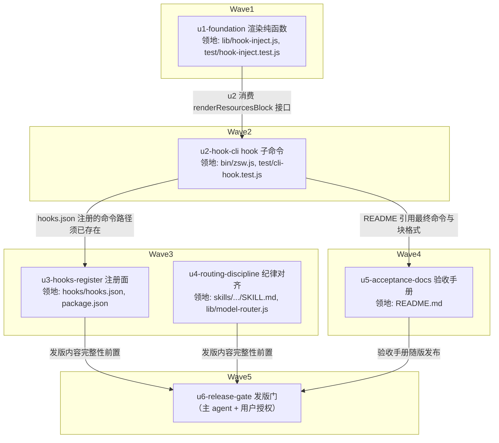

# zsw 会话启动资源注入 实施计划

基线: <本文件 commit hash> | 来源设计: docs/design/zsw-session-start-injection-design.md（v3.1，三轮对抗审查 must-fix=0，见 git c25b3c1） | 日期: 2026-08-29

## 0 章节映射

| 内容 | 设计文档实际位置 |
|------|--------------|
| 背景/目标 | §1 背景目标（SCQA + G1-G4 + in/out-scope） |
| 终态/机制 | §3 解决方案（§3.1 终态含注入块样例与成败路径 / §3.3 决策 D1-D7 / §3.4 物理数据流） |
| 验收场景表 | §4 验收（S1-S7 真实场景表，含场景/步骤/通过标准/回溯目标） |
| 下一层拆分 | §5 下一层拆分（U1-U6） |
| 待验证检查点 | §3.5 探针清单（P-cwd/P-resume-dup/P-isolated-home/P-cold-start/P-token-budget 为 ⛔ 实施期门）+ §5 末「待验证检查点」 |

## 1 目标快照（逐字摘录）

**G1 路由信息零调用可得**：主 agent 在新会话里不跑任何命令，就能回答「现在有哪些模型可跑 / 默认是哪个 / 短名和全名各自怎么用」，且与权威源一致（一致性口径见 D3：默认 provider 段按**模型名单 + 默认标记**与 `zsw models` 一致，字段粒度不做要求；其余 provider 为全名形态的并集展示）。

**G2 路由决策一步到位**：agent 派发 zsub 任务时直接从上下文取模型引用，省掉「先 `zsw models` 再 start」的两步。

**G3 快照过期能自愈**：会话中途环境变化（GUI 停用 provider 等）导致快照失真时，agent 有明确的兜底路径且不会因传错模型名而卡死（传错会收到带可用清单的可操作报错——既有行为，注入块让它更少发生）。

**G4 无害性**：未启用插件的会话零影响（无 hook 可言）；启用插件的会话注入硬预算快照（≤45 行），不报错、hook 执行延迟 <500ms（hook 内联执行，延迟计入会话启动，故设 500ms 性能门 + 5s 超时上限）；被 spawn 的嵌套子会话不注入。（会话启动时无法预判该会话是否使用 zsw——SessionStart 的 matcher 值域只有启动源，故「装了插件但全程没用 zsw」的会话也付这份 token，这是 §3.2 已声明的方案代价，由预算硬上限约束。）

**Out-of-scope**：模型路由策略本身（档位表在用户全局 AGENTS.md，属用户配置）；向 zsub spawn 的子代理会话注入（D4 有意不做）；MCP 工具面复活；zcode 引擎侧任何改动。

## 2 单元列表

| Unit | 职责 | 领地（精确文件路径，均相对 z-subagent-workflow/） | 依赖 | 隔离 | 验收条款 |
|------|------|------|------|------|------|
| u1-foundation | `lib/hook-inject.js` 纯函数 `renderResourcesBlock()`：两层 models 渲染（默认 provider 名单+默认标记不筛 apiKey；其余 apiKey 非空且模型非空 provider 全名形态）/ UUID 8 位缩写对照 / agents 20 字截断 / ≤45 行预算截断（优先保留 models，先截 agents 再截 workflows，标注指向对应查询命令）/ 兜底行。配套单测 | lib/hook-inject.js（新增） test/hook-inject.test.js（新增） | — | plain | `node --test test/hook-inject.test.js` 全绿；用 fixture 断言：两层结构、默认标记、截断序（构造超预算输入）、UUID 缩写、apiKey 过滤口径（默认段不过滤、其余段过滤） |
| u2-hook-cli | `bin/zsw.js` 新增 `hook session-start` 子命令：嵌套守卫（ZSW_NESTED=1 → stdout `{}` + exit 0，**不得复用 ensureNotNested 的 exit 1**）→ projectDir 解析（`ZCODE_PROJECT_DIR` > `process.cwd()`）→ 读四源（v2 config / **cli config 的 model.main（默认标记依据，defaultModelRef 回退链与 zsw models 同源）** / agent-md-resolver.list / workflow-script.listScripts + 内置五名）→ u1 渲染 → 严格 JSON `{"hookSpecificOutput":{"hookEventName":"SessionStart","additionalContext":…}}`；任一异常 → `{}` + exit 0 + stderr 诊断。配套单测（child_process 真跑子命令） | bin/zsw.js（仅新增 hook 子命令分支 + usage 文案） test/cli-hook.test.js（新增） | u1（消费 renderResourcesBlock 接口） | plain | `node --test test/cli-hook.test.js` 全绿；覆盖：ZSW_NESTED=1 输出 `{}` 且 **exit 0**；正常路径输出含 `<zsw-resources` 的 additionalContext 且 JSON 可解析、**渲染文本 ≤45 行（P-token-budget 可脚本承接）**；ZCODE_PROJECT_DIR 指向含项目级 agent 的 fixture 时输出含该 agent 名（P-cwd 的可脚本部分）；v2 config 不可读时 `{}` + exit 0；默认标记回退链（cli 缺失 → v2 顶层 model.main → 内置回退） |
| u3-hooks-register | `hooks/hooks.json`（SessionStart，type command，`node "${ZCODE_PLUGIN_ROOT}/bin/zsw.js" hook session-start`，timeoutMs 5000，无 matcher）+ `package.json` files 加 `"hooks/"` | hooks/hooks.json（新增） package.json（仅 files 数组） | u2（注册的命令须存在） | plain | `node scripts/check-pack.js`（workspace 根跑）通过；hooks.json JSON 可解析且事件名/字段符合官方契约（七事件之一、command 型字段集） |
| u4-routing-discipline | SKILL.md 路由纪律改写：快照优先 + 默认档位不假设（重任务显式传短名）+ 兜底（报错内清单零依赖权威 / zsw models 需 daemon 前置）；`lib/model-router.js:218` 注释「默认标记：重量任务省略 model 即用它」同源失真对齐 | skills/zsub-zflow-orchestration/SKILL.md lib/model-router.js（仅 :218 附近一行注释） | — | plain | 人工核验：SKILL.md 不再含「重量任务不传 model」类默认=重表述；含 `<zsw-resources>` 快照优先表述与兜底两条路径；model-router.js 注释不再断言默认=重量 |
| u5-acceptance-docs | README 验收手册补 S1-S7 场景（场景/步骤/通过标准表）+ 手工探针命令（P-cwd/P-cold-start 手跑命令）+ 已知边界（快照语义/GUI 重启生效/嵌套不注入） | README.md（新增章节，不改既有内容） | u2（文档引用最终命令与块格式） | plain | 人工核验：S1-S7 与设计 §4 一致；含 chmod 000 最小窗口的 S5 步骤与恢复；GUI 手工场景标注「需重启 ZCode + 真实 token」 |
| u6-release-gate | 发版 minor（`node scripts/release.js z-subagent-workflow minor`，三处版本 + tag）+ 合入 main 流程。**主 agent 执行，push/发布须用户授权** | workspace 根 scripts 触达的三处版本文件 + marketplace.json | u3, u4, u5 | plain | check-sync / check-pack / check-release-needed 全绿；tag 生成；`node --test test/` 全量绿（收尾场景，含真实模型 e2e 约 3.5 分钟，token 成本已知） |

## 3 DAG

领地交集检查：u1 {lib/hook-inject.js, test/hook-inject.test.js} ∩ u2 {bin/zsw.js, test/cli-hook.test.js} ∩ u3 {hooks/hooks.json, package.json} ∩ u4 {SKILL.md, lib/model-router.js} ∩ u5 {README.md} = ∅。worktree 决策：无热点公共文件（bin/zsw.js 仅 u2 触碰；package.json 仅 u3），全部 plain。

## 4 测试策略

命令实取自 workspace AGENTS.md（测试用 node 内置 runner，无 package scripts 包装）：

- **增量**（单元开发期，cwd = z-subagent-workflow/）：
  - u1: `node --test test/hook-inject.test.js`
  - u2: `node --test test/cli-hook.test.js`
  - u3: `node scripts/check-pack.js`（cwd = workspace 根）
- **全量**（收尾 Gate A，cwd = z-subagent-workflow/）：`node --test test/`——含真实模型 e2e（约 3.5 分钟、token 成本），在 u6 前执行一次
- **一致性**（cwd = workspace 根）：`node scripts/check-sync.js` && `node scripts/check-pack.js` && `node scripts/check-release-needed.js`
- **MCP 冒烟**（hook 不经 MCP，但保险起见 u6 前跑一次确认 server 未被波及）：`printf '...' | node dist/mcp/server.js`

## 5 合理偏差登记表

| # | 偏差 | 理由 | 状态 |
|---|------|------|------|
| 1 | u1：agents 段为「段头 + 每 agent 一行」，非 §3.1 样例的单行 ` · ` 连接 | D3 证据「两层渲染约 15-20 行」（6 agents 每行一条 = 19 行落区间）；单行形态行数不随数量增长，与截断机制矛盾；超长单行违背 G4 token 意图 | 已固化 |
| 2 | u1：其余 provider 每 provider 一行（模型 ` · ` 连接） | 样例折行无确定性规则属文档示意；每 provider 一行可确定渲染 | 已固化 |
| 3 | u1：models 极端超常（40+ provider）时可击穿 45 行上限 | D3「models 永不截」与硬上限极端下不可兼得，取 models 优先；现实 GUI 配置个位数量级不触发 | 已固化 |
| 4 | u1：UUID 对照在每个 UUID provider 首次出现处附一次 | D3 语义；样例中二次出现无对照视为示意省略 | 已固化 |
| 5 | u1：require model-router 的 PROVIDER_ID 作默认 provider 常量（未以 DEFAULT_PROVIDER_ID 名义导出，值同源） | model-router.js:30 直接赋值同值，口径同源 | 已固化 |
| 6 | u2：内置五名复用 bin/zsw.js 既有 BUILTIN_WORKFLOW_INFO 常量 | 同源要求；常量注释声明名字集合以 lib/workflow-manager 为准 | 已固化 |
| 7 | u2：`hook <未知事件>` → stderr + usage + exit 1（CLI 调试面 fail-fast） | hooks.json 只调 session-start，引擎路径永不触发；嵌套守卫仍在其之前（ZSW_NESTED=1 时任意事件名都 {} + exit 0） | 已固化 |
| 8 | u2：第 5 个测试用例原为「cli config 缺失 → 默认标记缺席仍渲染」；一致性审查修复后翻转为「defaultModelRef 回退链生效」（v2 顶层 model.main → 内置回退，两层可区分断言），与 zsw models 默认标记口径对齐 | 原「读不到为 null」分支被回退链取代（设计 D3 同步补述）；三层回退各有互斥用例 | 已固化（R1 修复批后更新） |
| 9 | u5：S5/S7 步骤命令补全（chmod 644 全路径、check 脚本加 node 前缀与 cwd 说明）、S2「见 §3.1」改指文内样例、块样例旁注明两处实际渲染差异（偏差 #1/#4） | 手册命令须真实可跑；渲染差异注明避免 GUI 断言误判 | 已固化 |
| 10 | u1：渲染签名细化为 `{v2, cliModelMain, agents, scripts, builtinWorkflows, nowIso}`（设计 U1 示意为 `{v2config, cliConfig, agents, scripts, projectDir}`） | 渲染只需 main 字段；纯函数不做目录定位；时间与内置名单注入可测 | 已固化（一致性审查 R1 合理项） |
| 11 | u1：workflows 段 script>0 时行内列名（D3 只要求数量） | 行内 join 不增行数，预算按行控不受影响；agent 免查即得名单 | 已固化（一致性审查 R1 合理项；设计 D3 已同步补述） |
| 12 | u2：v2 config 直读（readFileSync）而非复用 model-router 的 readV2Config（其 null 语义会产出残块） | hook 需「读失败→整体 {} 降级」；路径常量与 JSON.parse 口径仍同源 lib/config.js | 已固化（一致性审查 R1 合理项） |
| 13 | u5：手册额外收录 P-nested-guard 复跑命令（u5 领地承诺两条探针） | 与 §3.5 逐字一致，提升验收覆盖 | 已固化（一致性审查 R1 doc-error 修复） |
| 14 | u4/u5 补强：SKILL.md agents 面查询句加快照优先条件限定；README S1 通过标准加 ④ 项目级 agent 断言（P-cwd GUI 侧落点）与设计文档仓库定位前缀 | 一致性审查 R1 修复：快照优先两级纪律全文一致；P-cwd 断言原无场景承载 | 已固化（一致性审查 R1 修复批） |
| 15 | u2 修复批：默认标记改用 model-router 导出的 defaultModelRef（回退链与 zsw models 同口径），cli config 直读从 hook 分支移除；头注/行号锚点/≤45 行断言随批修正。定向复审再修 4 minor：hook-inject JSDoc 来源描述、偏差 #8 翻转更新、README S1 ④ 步骤变体说明、README:76 既有裸相对路径统一为源仓库前缀形态（全局规则 4：同文件两模式并存，触达时统一） | R1 审查 unreasonable 3 条 + doc_error 若干 + 复审 4 minor 全闭环 | 已固化（R1 修复批 + 复审批） |
| 16 | 架构修复批（双视角审查 1 high + 2 major + 4 medium + 6 minor 全修，commit 6118660/14fbbbb/1e821f3）：① scripts 发现改 listScriptNames name-only 零 require（安全面：会话启动不再执行仓内脚本顶层代码）；② hook 抽 bin/zsw-hook.js 薄入口 + lib/hook-source.js（依赖 require 全 try 包裹，插件文件缺失全降级 {} + exit 0）；③ 默认标记谓词收敛 defaultModelFor 单一导出 + 块内恒显「当前默认」行；④ zsw models --all 跨 provider 兜底；⑤ zsub start --local 嵌套盲区修补（pre-existing F-A7）；⑥ 三纯谓词导出（availableModels/splitModelRef/hasProviderCredentials）；⑦ 截断码点安全；⑧ README/SKILL 权威序声明与超时/PATH/stdout 截断监控点。实现偏差：hasProviderCredentials 权威定义在 driver.js（避 require 环）由 model-router 转口；defaultModelFor 第三参可选 ref 字符串（保 hook-inject 零 IO）；内置五名在 hook-source 常量（权威源 workflow-manager，避免拉全链） | 架构审查修复；dist/mcp/server.js 为 models --all 落点（vendor 面） | 已固化（架构修复批） |
| 17 | 收尾批（定向复审 N1-N3，commit 02ebd33）：FALLBACK_LINE 常量对齐 README 样例（含 --all 与权威序声明，渲染器/README/测试三处一致）；delegator 头注如实化（CLI 面顶层依赖全链文件缺失即退 1，引擎面必须走 zsw-hook.js；惰性 require 登记为后续优化）；内置五名第三副本加 WorkflowManager 键集锚定测试。复审结论：F1-F7 中 6 条成立、F3/F5 运行面缺口由本批闭合；平台侧全闭合 + 3 info（countUsableProviders 复刻仅诊断用、stdin 不消费两项接受登记） | 定向复审 new_issues 清零 | 已固化（收尾批） |
| 18 | 后续演进注记（2026-08-31，非本计划偏差）：model-router 导出面收缩——hasProviderCredentials/defaultModelFor 移出导出（谓词本体保留为内部单一实现）；hook 默认标记解析经 defaultModelRef（hook-source 消费），hook-inject 默认标记判定改走 availableModels/qualifiedProviders 内联实现 | 并行重构收缩导出面；设计文档 D6/§3.4 与变更历史已同步为终态，上表历史行按原样保留 | 已固化（导出面收缩跟进） |

## 6 状态表

| Unit | 状态 | 轮次 | 证据指针 |
|------|------|------|----------|
| u1-foundation | committed | 1 | `node --test test/hook-inject.test.js` 10/10 绿（主 agent 复跑确认）；偏差 5 条登记 §5 |
| u2-hook-cli | committed | 1 | `node --test test/cli-hook.test.js test/hook-inject.test.js` 15/15 绿（主 agent 复跑 + 亲跑嵌套守卫/正常路径 exit 0）；偏差 3 条登记 §5 |
| u3-hooks-register | committed | 1 | check-pack + check-sync 绿（主 agent 复跑）；hooks.json 形态逐字段对照先例与官方 schema |
| u4-routing-discipline | committed | 1 | 失真表述 grep 零命中 + 49/49 测试绿（主 agent 复跑）；SKILL.md:73/:114 与 model-router.js:218 对齐 |
| u5-acceptance-docs | committed | 1 | 纯追加 65 行（git diff 0 deletions）；S1-S7 与设计 §4 逐单元格比对 + 命令实跑存在；偏差 1 条登记 §5 |
| u6-release-gate | blocked（等用户裁决发版与 push） | 0 | Gate A 全量 470/470 绿 + check 三件套绿；check-release-needed 报 UNRELEASED（1.1.0 未 bump，符合待发版状态） |

**Gate 执行记录（2026-08-29）**：Gate A = `node --test "test/*.test.js"`（cwd=z-subagent-workflow/）470 pass / 0 fail / 0 skipped（27 文件静态声明 470 用例与运行数吻合；AGENTS.md 字面命令 `node --test test/` 在 Node v24.11.1 把目录当模块加载不可用，等价 glob 替代——AGENTS.md 命令漂移已在残留风险登记）；check-sync / check-pack PASS。Gate B 可脚本半边 5/5 pass：S4（真实 spawn 子代理答「没有」注入块）、S5（空 HOME → `{}`+exit 0+stderr 诊断）、P-cold-start（3×0.03s 中位 30ms <500ms）、P-token-budget（19 行/约 304 token ≤ 上限）、P-cwd（无关 cwd 下 ZCODE_PROJECT_DIR 定位项目级 agent 正确）。GUI 半边（S1/S2/S3/S6 及 S4/S5 的 GUI 断言）待用户按 README 手册真机执行，未以 mock 冒充。

## 7 残留风险与变更历史

- **S1-S6 GUI 真机验收不在 subagent 单元内**：这些场景需重启 ZCode + 真实会话，属交付后用户/主 agent 手工验收（README 手册承载）。subagent 单元只覆盖可脚本化断言（P-nested-guard 复跑 / P-cwd 可脚本部分 / 单测）。
- **模型路由说明**：本环境 Agent 工具无 model 参数（引擎原生后台 agent 不支持 per-start 模型指定），subagent 以会话默认模型派发；全局路由表的「看不到指定模型先确认」条款按「无可见选项」处理，已如实登记。
- **分支现状**：本 worktree 分支 fix-review-fix-loop 上有 12+ commits 未 push 未发版（含 review-fix-loop v2.1 修复）；本计划完成后 u6 发版会把两批变更一并带出——是否拆开发版由用户在 u6 门决定。
- **残留风险（交付时点）**：① GUI 真机验收（S1/S2/S3/S6 及各 GUI 半边断言）未执行——需重启 ZCode + 真实会话，剧本在 README 手册，属用户手工验收；**无头侧验证已尝试并确认不可行**（架构修复批 C 探针：合成 HOME 同时具备 provider 凭据与 inline 插件注册，无头会话正常跑通、引擎日志证实插件已加载 `plugin:z-subagent-workflow`，但注入块未出现、无 SessionStart 执行记录——无头形态不触发 SessionStart hook，GUI 是注入链路的唯一验证载体）；② `node --test test/` 字面命令在 Node v24.11.1 不可用（目录被当模块入口），AGENTS.md 命令漂移待修（与 v2.1 工作线遗留的「AGENTS.md 命令漂移」同源，合并处理）；③ 发版未执行（u6 等用户裁决：本特性 minor 与并行工作线 v2.1 修复是否同批发版、push 授权）；④ 报错内清单的 provider 过滤口径（仅模型非空，不过滤 apiKey）与注入块口径（apiKey 非空）存在已知情差异——属 resolve/bootstrap 两层既有语义，未改动（改动面大），agent 按报错清单重传无凭据 provider 名时在 bootstrap 阶段收到可操作报错。
- 变更历史：v1 基线 2026-08-29；同日执行完成 u1-u5（2add250/ffc8c83/f1009f7/3ff64ba/c1fac0d）+ 一致性审查 R1 修复批（4804a29，定向复审确认全成立）+ Gate A/B 执行记录登记；**架构修复轮**（双视角审查 1 high + 2 major + 4 medium + 6 minor 全修）：批 A1 谓词收敛（6118660）、批 A2a 自包含薄入口（14fbbbb）、批 A2b delegator + models --all + --local 嵌套盲区（1e821f3）、批 B 文档权威序与监控点（22a2701）、批 C 无头探针（结论登记如上）。
