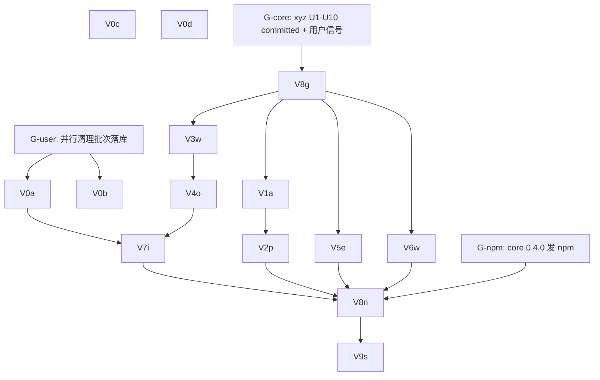

# zsw 下沉消费收口实施计划

基线: cfd510b | 来源设计: `docs/design/zsw-sink-adoption-design.md`（对抗审查三轮收敛：R1 5MF/7S/4I → fe720d6；R2 3MF/5S → 45536fc；R3 聚焦收口 → cfd510b，终态 0 must-fix）| 日期: 2026-08-31

**依赖与门**：xyz 侧 U1-U10 由用户并行实施（xyz-agent-workspace `feat-subagent-core-host-surface`，本计划全程不触碰该仓）。三道门：
- **G-user**（Wave 0 前置）：本 worktree 存在并行会话简化清理批次（23 文件未提交，含 worktree.js/record-store.js/model-router.js 等 V 单元领地）——该批次由其所属会话 commit 落库后，Wave 0 领地冲突解除。
- **G-core**（Wave 1 前置）：xyz U1-U10 committed + 用户开工信号 → `vendor --local` 刷新可供消费。
- **G-npm**（Wave 2 前置）：core 0.4.0 发布 npm（用户授权链）→ `--npm` 终态刷新。

## 0 章节映射（来源设计文档坐标，subagent task 唯一坐标来源）

| 内容 | 实际位置 |
|------|----------|
| 背景/目标 | §1（1.3 目标 G1-G5、1.4 Scope/Out of scope） |
| 终态/机制 | §3（3.0 依赖契约签名、3.1 终态、3.2 裁决 E1-E6、3.3 D-E1~E5 四件套 + 错误规格表） |
| 验收场景表 | §4（S1-S5，真实依赖禁 mock） |
| 下一层拆分 | §5（5.2 设计单元 V1-V9、5.3 文件改动地图、5.4 检查点 ⛔A-D、5.5 版本与发版） |

## 1 目标快照（逐字摘录 §1.3 / §1.4）

| # | 目标 | 验证锚点 |
|---|---|---|
| G1 | **复刻清零**：审查点名的复刻实现全部退役（worktree.js 289 行 → 锚点适配层、agent-discovery parser/normalizeAgentRef 退役、slots 收敛、normalizeRunParams 白名单退役），lib 总行数净减 | §4 S1 |
| G2 | **漂移修复落地**：30min floor、`..` 收紧、block-scalar/maxTurns 口径三项用户可见修复生效 | §4 S2 |
| G3 | **契约统一**：workflow ref 走 core `normalizeWorkflowRef` 单一权威；record-store 归属有裁决结论 | §4 S3 |
| G4 | **三形态不破**：marketplace 副本 / inline dev / npm 包行为一致，vendored 自检防「半刷新」 | §4 S4 |
| G5 | **发版一次到位**：全部行为变更（含 break）随 zsw 2.0.0 单版本消化，release notes 完整 | §4 S5 |

Out of scope（§1.4 逐字）：core 侧改造（姊妹文档，本插件只消费）；zsw record 状态机到 core 模型的物理迁移（本设计裁决「暂不下沉 + 参数化」，物理迁移另立项）；zsub ledger/reaper/mailbox/jsonout 等 7 项已裁决平台绑定面（维持现状）；workflow 线并发配额（已裁决文档化，不加门闩）。

## 2 单元列表

| Unit | 职责 | 领地（精确文件路径，均在 `z-subagent-workflow/` 下除注明外） | 依赖 | 隔离 | 验收条款 |
|------|------|------|------|------|------|
| V0a | record-store 路径参数化（设计 E4/V7 项零依赖前半）：`new RecordStore({ filePath })` 注入，缺省行为不变 | `lib/record-store.js`、`lib/assemble.js`（唯一 lib 内构造点 :90）、`test/domain.test.js` | G-user | plain | 参数化后缺省路径行为等值（现有测试全绿）+ 显式 filePath 生效（新增断言） |
| V0b | modelEntries 宿主内消重（设计 V8 前半）：双份 modelEntries 产出参数化收敛为 toModelEntries 单实现（首步 grep `modelEntries` 定位双份点并登记） | `lib/model-router.js` + grep 定位的消费文件（实施首步登记） | G-user | plain | 消重前后产出逐字段等值（对照断言）+ 相关测试绿 |
| V0c | E4 后半立案锚：`docs/design/zsw-manager-convergence.md` 占位文档（record 状态机统一 + manager 收敛另立项，登记 D-E4 依赖） | `docs/design/zsw-manager-convergence.md`（新增） | 无 | plain | 文档含裁决转载 + 触发条件（动作层消费 core 后同窗） |
| V0d | 验收准备：S2③ 资产 `test/fixtures/t-sink.md`（block-scalar description + `maxTurns: 2` + 多行 tools，对齐姊妹 S1 同一资产）+ S5② 种子脚本 `test/fixtures/make-legacy-state-files.js`（25 个历史 workflow-state 文件，其中 10 个无 `v` 字段改造前格式） | `test/fixtures/`（新增两件） | 无 | plain | 种子脚本跑出的目录被现状 loadAll 可读；t-sink.md 经现 vendored parser 可解析（现状解析能力缺失为已知预期，S2③ 验收时对照） |
| V8g | G-core 门动作 + 守卫扩展（设计 V8 后半开发期形态）：`node scripts/vendor-subagent-core.js --local <xyz worktree>/packages/subagent-core` 刷新 + `test/core-ref.test.js` 符号守卫扩展（新导出面全符号清单，以 §3.0 契约为准） | `lib/vendor/subagent-core/**`（生成物）、`VENDOR-MANIFEST.json`、`test/core-ref.test.js` | G-core | plain | 守卫对 §3.0 全符号绿；sha256 自检绿；「人为删一文件→守卫报错」负面验证过 |
| V1a | agent-ref 面消费（设计 V1）：normalizeAgentRef/expandHome/stem/报错文案退役改调 normalizeRef + 文案工厂；`..` 收紧生效；manager slug 长度闸 | `lib/agent-discovery.js`、`lib/manager.js`（slug 校验段）、`test/agent-discovery.test.js`（如无则实施时定位登记）、`test/manager.test.js`（slug 段） | V8g | plain | S2②（`..` 拒绝含恢复指引）+ slug 超长拒绝消息含上限值；符号退役 grep 归零 |
| V2p | agent 解析消费（设计 V2）：parseAgentMd/parseFrontmatter/scalar/toProfile 退役、parseFile 走 getCachedParsed、listAgents 装配循环退役改调 discoverAgents | `lib/agent-discovery.js`、装配测试文件 | V1a | plain | S2③（t-sink.md 经 `zsw agents` 清单 description/tools 完整）；parser 族符号 grep 归零 |
| V3w | workflow 面消费（设计 V3，⛔D）：loadScriptFromPath 鸭子退役改 loadWorkflowScriptByPath、registry 收缩差异合并层、validateWorkflowRef 三处口径统一改调 normalizeWorkflowRef（bin 入口/orchestration-host/daemon-MCP 壳——第三处实施首步 grep 定位登记）、knownNames 异步 + cwd 口径统一、saved 裸名放行 + 遮蔽 warning、`script:` 维持拒收 | `bin/zsw.js`、`lib/orchestration-host.js`、daemon/MCP 壳 ref 校验文件（首步定位登记）、相关测试 | V8g | plain | ⛔D 三入口 knownNames 同目录集同产出 + 遮蔽 warning 三入口一致；S3①②③ |
| V4o | 编排消费（设计 V4，⛔C）：recoverOrphans 改调 recoverCrashedRuns（错误文案参数传入）、runSummary/isScriptRunning 改调、normalizeRunParams 白名单退役改 meta 驱动（normalizeArgsByMeta/argKeysFromMeta/findFlattenedArgKeys）+ 组 args 前平铺检测接线 | `lib/orchestration-host.js`、`test/` 相关 | V3w | plain | ⛔C 现有全部合法参数集 meta 驱动零 warning（对照清单）；S5② 存量可读断言前置就绪 |
| V5e | 引擎与进程面（设计 V5）：MS_PER_TURN 退役改 maxTurnsToWatchdogMs（floor 恢复）、runner-core alive() spawn 分支与 daemon-socket probeLockHolder 改调 isProcessAlive、splitModelRef 改薄包装（splitZcodeModelRef）、hasProviderCredentials 与 core hasApiKey 统一非空 string 裁决 | `lib/runner-core.js`、`lib/model-router.js`、`lib/daemon-socket.js`、`test/runner-core.test.js` 等 | V8g | plain | S2①（maxTurnsToWatchdogMs(2) ≥ 1_800_000 函数级断言）；alive/probe 行为等值 |
| V6w | worktree 收缩（设计 V6，⛔A）：sidecar 持久锚点实现 + collectWorktreePatch(anchor) 等改调 core git-ops + 布局/孤儿策略层保留；289 行收缩至 ~60 行锚点适配 | `lib/worktree.js`、`lib/worktree-adapter.js`、worktree 测试 | V8g | plain | ⛔A sidecar 场景（新文件+已提交改动+daemon 重启）patch 产物等价 + 锚点缺失/损坏与 add 失败分支 warn+降级+`patchIncomplete` 留痕 |
| V7i | 基础设施（设计 V7 后半，⛔B）：slots 收敛 createConcurrencyPool strict-fifo 薄层（导出签名不变）、output-store.atomicWrite 与 notifier-mailbox tmp+rename 改调 atomicWriteFileSync、prune 接线（daemon 启动/session-start + env 上限透传） | `lib/slots.js`、`lib/output-store.js`、`lib/notifier-mailbox.js`、`lib/assemble.js`（prune 接线点）、daemon 启动文件（首步定位登记）、相关测试 | V4o、V0a | plain | ⛔B slots 现有排队测试在 strict-fifo 全绿；S6 原子写语义保持（残留 tmp 清理属 core 内部）；workflow-state 收敛断言就绪（真机部分归 V9） |
| V8n | G-npm 门动作（设计 V8 终态）：`vendor --npm 0.4.0` 刷新（manifest source 回归 npm 权威源）+ 守卫复验 + `check-pack` | `lib/vendor/subagent-core/**`、`VENDOR-MANIFEST.json` | G-npm、V1a-V7i 全 committed | plain | manifest source = npm；sha256 自检绿；S4①② |
| V9s | 回归与发版（设计 V9）：全量单测 + S1-S3/S5 真机场景 + ⛔A-D 终验关闭 + release notes 草稿（双语六项，D-E5）+ `node scripts/release.js z-subagent-workflow major`（执行前向用户要授权；push 另授权） | `docs/`（release notes/验收记录）、package.json/plugin.json/marketplace.json（经 release.js） | V8n | plain | Gate A（全量测试绿）+ Gate B（S1-S5 场景表逐行签收）双绿 |

## 3 DAG 图

并行说明：Wave 0 内 V0a/V0b/V0c/V0d 领地互斥可并行；Wave 1 内 V1a链/V3w链/V5e/V6w 四条链领地互斥可并行（daemon-socket.js 归 V5e 独占，V3w 的 daemon-MCP 校验点若定位到同一文件则 V3w→V5e 转串行并登记偏差）。

## 4 测试策略

- **增量（单元开发期）**：`cd z-subagent-workflow && node --test test/<受影响文件>.test.js`（单文件直跑；禁 `node --test test/` 参数形态——Node v24 下 MODULE_NOT_FOUND）。每单元只跑受影响测试文件。
- **收尾全量（V9s）**：`cd z-subagent-workflow && node --test`（无参形态；含真机 e2e，注意 token 消耗，按 test/e2e.test.js 与 README 验收手册执行）。
- **workspace 门禁**：`node scripts/check-sync.js`、`node scripts/check-pack.js`（V8n/V9s 前必绿）。
- ** vendored 自检**：每次刷新后跑 core-ref 守卫测试 + sha256 自检（vendor 脚本内置）。

## 5 合理偏差登记表

（空——执行期登记）

## 6 状态表

| Unit | 状态 | 轮次 | 证据指针 |
|------|------|------|----------|
| V0a | blocked（G-user：并行清理批次未落库） | - | - |
| V0b | blocked（G-user） | - | - |
| V0c | in-progress | 1 | 408ea95 基线后主 agent 撰写 `docs/design/zsw-manager-convergence.md` |
| V0d | in-progress | 1 | u-dev 后台执行中（test/fixtures/ 两件新增，零交集领地） |
| V8g | blocked（G-core） | - | - |
| V1a | blocked（G-core） | - | - |
| V2p | blocked（V1a） | - | - |
| V3w | blocked（G-core） | - | - |
| V4o | blocked（V3w） | - | - |
| V5e | blocked（G-core） | - | - |
| V6w | blocked（G-core） | - | - |
| V7i | blocked（V4o、V0a） | - | - |
| V8n | blocked（G-npm） | - | - |
| V9s | blocked（V8n） | - | - |

## 7 残留风险与变更历史

**残留风险**
1. 并行会话简化清理批次与 V 单元领地重叠（worktree.js/record-store.js/model-router.js/manager.js/orchestration-host.js 等）——本计划全程不触碰该批次；G-user 门 = 该批次由其所属会话 commit 落库。若其后续继续产生新改动，逐批核对后再开工对应单元。
2. xyz U1-U10 实施期签名若与 §3.0 转载契约漂移——以姊妹文档终稿为准，偏差走 design-code-sync（本设计 §3.0 同步修订 + 单元适配）。
3. `--local` 冒烟期 vendored sha256 自检与 CI 门禁——vendor 脚本既有能力，V8g 首跑验证；--local 态禁止进入发版（D-E2，无 --local 发版路径）。
4. 真机 e2e token 消耗——V9s 集中执行真机场景，单元开发期一律增量单测不碰 e2e。

**变更历史**
- 2026-08-31：起草。分工裁决（用户原话）：「xyz的我单独处理了，已经在开发中。你直接开发本项目的即可。」——xyz 侧 U1-U12 用户领走，本计划只覆盖 zsw 侧消费改造；计划评审随起草同轮提交用户。
- 2026-08-31：用户评审确认（切分/worktree/验收三项均确认）+ G-user 门裁决「先做无交集项 V0c/V0d」（并行清理批次持续增长中：检查期间 17→23→37 个 M 文件）。基线 commit 408ea95。
