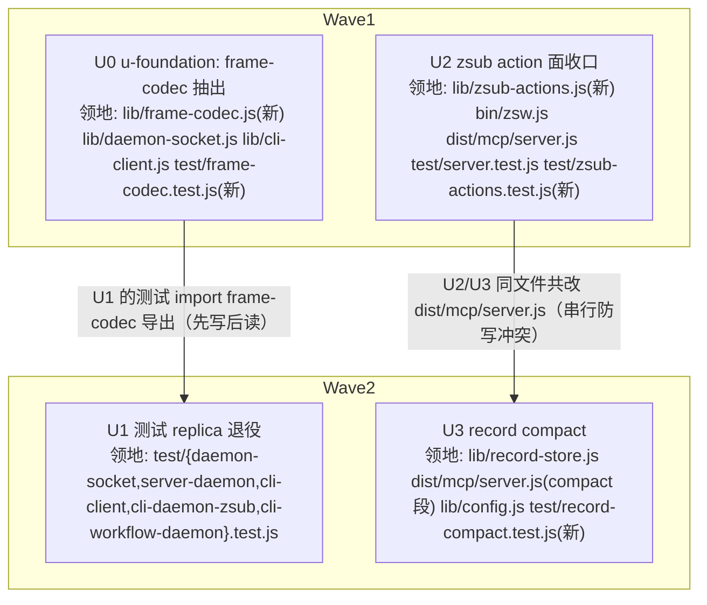

# zsw socket 面与 record 台账收口 实施计划

基线: c633091 | 来源设计: [zsw-socket-record-convergence-design.md](zsw-socket-record-convergence-design.md) | 日期: 2026-09-02

## 0 章节映射

| 内容 | 本文实际位置 |
|------|--------------|
| 背景/目标 | §1 背景目标（SCQA + 系统是什么 + 设计目标 1-4 + In/Out-scope） |
| 终态/机制 | §3 解决方案（§3.1 终态走查；§3.2 三线方案对比；§3.3 决策 D1-D9；§3.4 探针清单） |
| 验收场景表 | §4 验收（A1-A9，含步骤/通过标准/目标回溯） |
| 下一层拆分 | §5 下一层拆分（实施路径 U1-U3 + 文件改动地图 + 待验证检查点） |
| 待验证检查点 | §3.4 探针清单（P-frame/P-roundtrip/P-compact-equiv/P-occ/P-mount/P-keep-env）+ §5 待验证检查点 |

## 1 目标快照（逐字摘录自设计 §1）

设计目标：

1. **维护者改帧语法只动一处**：新增 `lib/frame-codec.js` 为唯一语法源，daemon-socket 与 cli-client import 它；测试不再手写构帧 replica（§2.1 的失败模式 A 消失）。
2. **维护者加/改 zsub action 只动一处**：action 表 + 执行 + 错误消息收进 lib 单一模块，CLI 与 daemon 两入口的执行语义由结构保证一致（§2.2 的失败模式 B/C 消失）。
3. **长期使用成本有上界**：`records.jsonl` 收敛到「活跃 run 全量 + 最近 N 个终态 run」，daemon 启动恢复成本与磁盘占用封顶（§2.3 的失败模式 D 消失）。
4. **使用者零感知**：CLI 命令输出、错误消息文本、MCP 冒烟形态、`--local` 语义全部不回归——三个收口都是内部结构整理。

Out-of-scope：统一 run 台账（`zsw-manager-convergence.md` 立案线）；zflow 面抽出 / dist→bin 反向 require；`--local` 拓扑与单一属主；core-ref 投影面；引擎收口三份；reaper outputs 删除能力。

## 2 单元列表

| Unit | 职责 | 领地（精确文件路径） | 依赖 | 隔离(plain/worktree) | 验收条款 |
|---|---|---|---|---|---|
| U0（u-foundation） | 帧 codec 单源：`lib/frame-codec.js` 抽出（encodeFrame + createFrameDecoder 从 daemon-socket 原样迁出）+ daemon-socket/cli-client 接线（cli-client 宽容过滤留 client 侧包装，D1）+ 两处头注 S8 段改写 + 单元锚 | `z-subagent-workflow/lib/frame-codec.js`（新）、`z-subagent-workflow/lib/daemon-socket.js`、`z-subagent-workflow/lib/cli-client.js`、`z-subagent-workflow/test/frame-codec.test.js`（新） | 无 | plain | P-frame：既有 daemon-socket.test.js 回归锚（半包/坏行/UTF-8/粘包）原样绿 + 新 frame-codec 单元锚绿（decoder 直接 push：跨 chunk UTF-8/坏行/裸值/半包）；A1 基线比对：`zsw list`/`agents`/`models` 双路径（daemon + `--local`）输出与收口前逐行一致 |
| U1 | 测试构帧 replica 退役：协议 replica 删（daemon-socket.test / server-daemon.test 改 import frame-codec）；假 daemon 构帧 import `encodeFrame`（三个 CLI 侧测试）；替身简化解析保留 + 注释定性（D2） | `z-subagent-workflow/test/daemon-socket.test.js`、`z-subagent-workflow/test/server-daemon.test.js`、`z-subagent-workflow/test/cli-client.test.js`、`z-subagent-workflow/test/cli-daemon-zsub.test.js`、`z-subagent-workflow/test/cli-workflow-daemon.test.js` | U0（import 其导出） | plain | A2：五个测试文件绿；`grep -rn "function encodeFrame\|createFrameDecoder" test/` 手写副本清零（替身简化解析的注释定性除外）；daemon-socket.test.js 的传输层字节级回归锚形态不退（锚组原样在） |
| U2 | zsub action 面收口：`lib/zsub-actions.js` action 表（D3 归属表：nested 门禁/未初始化检查留 server 入口包装层，agents/models 经 deps.ports）+ `--local` 查表 + message 不可达内联整段删（D6）+ okContent/unwrap 拆除 handler 直返（D5，zflow 返回形态同步）+ usage 与前置校验原样保留（D4）+「不支持的 action」表生成逐字一致（含尾句） | `z-subagent-workflow/lib/zsub-actions.js`（新）、`z-subagent-workflow/bin/zsw.js`、`z-subagent-workflow/dist/mcp/server.js`、`z-subagent-workflow/test/server.test.js`、`z-subagent-workflow/test/zsub-actions.test.js`（新） | 无（与 U0/U1 领地互斥；action 面不碰帧语法） | plain | P-roundtrip：收口前后同命令帧捕获比对逐字节一致；A3：两入口（`--local`/daemon）start(`--wait` 真跑)/status/cancel/close/message 拒绝路径输出一致 + 缺参输出仍 usage +「不支持的 action」逐字一致；A4：MCP 冒烟（tools/list 恒空、tools/call errContent 拒绝）；server.test.js 绿 + nested 门禁/未初始化守卫保留断言；A9 单测锚部分：三类可达错误消息逐字一致 |
| U3 | record compact：`RecordStore.compact({keep})`（D8：keep-N 整 run 截断/活跃与 lost 全保/孤儿行组保守保留/pid 后缀 temp + rename/size 双向复查放弃）+ server.js 挂点接线（startDaemon ready 判 role==='daemon' + onTakeover，不挂 main recover 后）+ `ZSW_RECORD_KEEP` 解析 | `z-subagent-workflow/lib/record-store.js`、`z-subagent-workflow/dist/mcp/server.js`（仅 compact 接线段）、`z-subagent-workflow/lib/config.js`、`z-subagent-workflow/test/record-compact.test.js`（新） | U2（同文件共改 dist/mcp/server.js，串行） | plain | P-mount：超阈值台账下双 MCP server 并发启动仅 daemon 出 compact 日志 + kill daemon 接管路径也触发；P-compact-equiv（含孤儿行组 fixture）：compact 后 rebuild 与保留子集索引逐字段一致；P-occ（双向复查两面）：放弃路径 + temp 清理 + 日志留痕；P-keep-env：正整数/回落/警告；A5-A8 真实场景（fixture 生成器 + 临时 ZSW_ROOT）：文件收敛 101 run、重启等价、`--local` 不触发、活跃/lost run 保真 |

注：U2/U3 对 `dist/mcp/server.js` 的编辑段落不同（zsub handler 段 vs compact 挂点段），但同文件即共改——按 dag-authoring 判据加串行边，U3 在 U2 committed 后开工。

## 3 DAG 图

Wave1 内 U0/U2 领地互斥且无数据依赖，可并行派发（并发 2 ≤5）；Wave2 同理（U1 依赖 U0、U3 依赖 U2 均已在前波 committed）。

## 4 测试策略

测试命令从项目 AGENTS.md 真实读取（cwd = `z-subagent-workflow/`）：

- **增量（单元开发期内）**：`node --test test/<具体文件>.test.js`（逐文件指定；Node v24 下禁 `node --test test/` 目录形态——会被当模块解析报 MODULE_NOT_FOUND）
  - U0：`node --test test/frame-codec.test.js test/daemon-socket.test.js test/cli-client.test.js`
  - U1：`node --test test/daemon-socket.test.js test/server-daemon.test.js test/cli-client.test.js test/cli-daemon-zsub.test.js test/cli-workflow-daemon.test.js`
  - U2：`node --test test/server.test.js test/zsub-actions.test.js`
  - U3：`node --test test/record-compact.test.js`
- **全量（收尾阶段 5 与一致性审查后）**：`node --test`（无参形态，AGENTS.md 规定）
- **MCP 冒烟（U2 验收 A4）**：AGENTS.md 冒烟命令（initialize + notifications/initialized + tools/list 管道喂 `dist/mcp/server.js`）
- **CLI 行为基线（A1/A3）**：实施第一步先录收口前输出基线（设计 §5 待验证检查点：无基线则比对无基准），存 `test/fixtures/baseline/`（若 gitignore 冲突则 `/tmp` + 记录于状态表证据指针）
- **e2e 真机**：不涉及（本设计行为零变化，无新引擎交互面）；A5-A8 用临时 ZSW_ROOT 的真实 daemon 进程替代

## 5 合理偏差登记表

| 偏差 | 类型（合理/不合理/doc_error） | 处置 |
|---|---|---|
| 基线录制发现：`--local` 现状不支持 agents/models/wait（报「未知子命令」），而 zsub-actions 表含全集——若 `--local` 查表开放全集即行为变化 | doc_error（设计缺口，非实现偏差） | 已修设计 D3 效果段：`--local` 查表但保持 6-action 子集，agents/models/wait 维持「未知子命令」现状（入口侧过滤） |
| U2 实施发现：`--local` 的 status/cancel/close/message 不带 `--id` 时错误消息从 manager 层 `subagent "undefined" 不存在` 变为表内前置校验「缺少必填参数 subagentId…」（与 daemon 现状一致） | 合理（D3 前置校验随 exec 迁表的结构必然；消息从劣质 undefined 拼接变为可操作文案；两入口一致即目标 2 方向） | 已固化设计 D4 效果段「已声明的边缘对齐」；zsub-actions.test.js 缺 subagentId 全文断言锚定 |
| U2 全量测试发现：`node --test` 无参全量会误扫 test/fixtures/make-legacy-state-files.js（fixture 生成器无参 exit 2 被当测试执行）——HEAD 干净态复现同样失败，非本次引入 | 合理（认知外既有问题，不在任何单元领地） | 登记残留风险第 5 条；收尾阶段单独修复（不混入单元 commit） |

## 6 状态表

| Unit | 状态(pending/in-progress/committed/blocked) | 轮次 | 证据指针 |
|---|---|---|---|
| U0 | committed | 1 | 36/36 绿（frame-codec/daemon-socket/cli-client 三件套重跑核实）；传输层字节级回归锚零改动原样绿；A1 双口径比对 11/11 段 PASS + pre/post 完整输出互 diff 零差异；list 帧与 baseline-frames.txt 逐字节一致；cli-client close 无尾换行宽容语义等价实现（close 补推 \n flush，测试锚定） |
| U1 | committed | 1 | 59/59 绿（五文件重跑核实）；A2 grep 手写 encodeFrame/createFrameDecoder 副本零命中；daemon-socket.test.js 回归锚组五用例零改动（仅构帧来源换 import）；server-daemon 内嵌解析判定为协议 replica 类删除（头注自认同形）；三处故意畸形流构造保留（宽容性 fixture，非 replica） |
| U2 | committed | 1 | 47/47 绿（server + zsub-actions 重跑核实）；P-roundtrip 五类帧逐字节一致；CLI 双路径基线逐字一致（含「未知子命令」16 行 usage 全文）；A4 冒烟过（tools/list 恒空 + tools/call errContent）；A3 真跑 closed/result ok/exit 0（1 次真实模型调用）；A9 非 conversation 路径逐字一致；全量 433/434（1 失败 = HEAD 既有 fixture 误扫，干净态复现，零因果） |
| U3 | pending | 0 | — |

## 7 残留风险与变更历史

**残留风险（承接设计，实施期盯防）**：

1. P-roundtrip 帧逐字节比对依赖基线先行（收口前录）——漏录则该探针失效。
2. D9③ compact 残余微窗（复查点与 rename 间）：设计层面接受；若实施期构造出真实丢失行复现，升级回设计重议。
3. A9 busy/续聊真实场景不可稳定构造（`--local` 视角状态域不含 busy）——缺口已声明，P3 冷续聊回归时补。
4. zsw 版本未 bump：本计划全部改动在 files 白名单内，收尾时 `node scripts/check-release-needed.js` 将提示待发版——发版与 push 等用户授权（不在本计划内）。
5. `node --test` 无参全量误扫 `test/fixtures/make-legacy-state-files.js`（HEAD 既有，U2 期间发现）——收尾阶段单独修复，Gate A 全量绿以此为前置。

| 日期 | 事件 |
|---|---|
| 2026-09-02 | 计划创建（基线 c633091：设计文档 + 审查报告 commit） |
