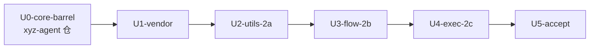

# zsw 回接 subagent-core（P2）实施计划

基线: 6c2151f | 来源设计: `/Users/zhushanwen/Code/xyz-agent-workspace/main/docs/design/subagent-core-package-extraction.md`（权威，两轮对抗审查 must_fix==0 + 实现后一致性审查 r5 收敛 0/0/0；原 dev-0.9.11 分支已于 2026-08-30 经 PR #194 合入 main 并删除，core 0.2.0 已发 npm） | 日期: 2026-08-30

用户授权（2026-08-30 本会话原话）：「整体可以将当前项目的插件删除重构，或者你认为的最合适的方式进行重构。历史代码可以不需要不保留」——据此：appserver 通道按 D6-⑥ 直接退役、`script:<name>` 旧契约按 D6-⑧ 显式 break（不保留降级旧通道）、不受「复刻旧段」义务约束的壳面简化均可做。

## 0 章节映射（来源设计文档坐标，subagent task 唯一坐标来源）

| 内容 | 实际位置 |
|------|----------|
| 背景/目标 | §1 背景目标（设计目标 1-5、in/out of scope） |
| 终态/机制 | §3 解决方案（D1-D9；§3.5 终态数据流）；D6 接管段落 ①-⑧ 在 §3.3 D6 之后「接管/替换既有流程的副作用核对」段 |
| 验收场景表 | §4 验收（V1-V7；P2 相关：V2/V3/V5/V6-②/V7） |
| 下一层拆分 | §5（P2 行 = 2a/2b/2c；P3 后续演进） |
| 待验证检查点 | §5 末（检查点 3 = D7 存量调研门；检查点 6 = symlink 策略） |

## 1 目标快照（逐字摘录设计 §1 关键约束）

- 设计目标 1「修复一次，双宿主生效」、目标 3「zcode 宿主升级到统一实现的全量能力」、目标 4「两宿主特有能力不丢失（zcode 的 daemon + task-notification 唤醒）」。
- out of scope（逐字）：「zsw daemon 自身架构改造（保留现状，只换底座）；zcode 主会话引擎切换；第三引擎实现」。
- 本计划范围 = 设计 §5 P2 行（2a/2b/2c）在「删除重构授权」下的执行：zsw 从自有 vendored 实现切换为消费 `@zhushanwen/subagent-core`（经构建期 vendor，见偏差 #1）。

## 2 单元列表

| Unit | 仓 | 职责 | 领地（精确路径，前缀 `z-subagent-workflow/` 省写为 `
/`；workspace 根省写为 `<W>/`） | 依赖 | 隔离 | 验收条款 |
|------|----|------|------|------|------|----------|
| U0-core-barrel | xyz-agent | core 0.2.0：barrel 扩面（宿主壳 API）+ FileRunStore（D2 设计件补实现）+ 自包含 CJS bundle 构建档 | `packages/subagent-core/src/index.ts`、`src/orchestration/file-run-store.ts`(新)、`src/orchestration/__tests__/file-run-store.test.ts`(新)、`tsup.config.ts`、`package.json`(0.2.0+scripts)、`README.md`、（如仓规需要）`.changeset/*.md` | — | plain | ①core `pnpm test`+`typecheck`+闭包守卫（含 `--self-test`）全绿；②CORE_PACKAGE_VERSION≡0.2.0；③bundle 自包含探针：干净 cwd require 成功且 bundle 内 ajv/yaml/proper-lockfile 外部 require 零命中、`node:sqlite` 零命中（D9 落地注记）；④FileRunStore 单测（save/loadAll 往返、stateFilePath=<dataRoot>/workflow-state/<runId>.jsonl、损坏行容错） |
| U1-vendor | zsw | vendor 基建 + 仓规修订 + 单一解析点 | `<W>/scripts/vendor-subagent-core.js`(新)、`
/lib/vendor/subagent-core/`(新，vendored 产物入 git：index.cjs+workflows/+VENDOR-MANIFEST.json)、`
/lib/core-ref.js`(新，requireCore()/workflowAssetPath()/CORE_VENDOR_VERSION+启动版本 guard)、`<W>/AGENTS.md`(零依赖红线例外条款)、`<W>/docs/standards.md`(vendored 消费节)、`
/README.md`(消费说明) | U0 | plain | ①干净进程经 core-ref require 成功（runWorkflow/configureCore 为函数）；②check-sync/check-pack 双绿（package.json 仍零 dependencies）；③vendored `workflows/review-fix-loop-utils.cjs` 与 core 源字节一致（vendor 脚本自检断言）；④standards.md 记录三形态（inline/marketplace/npm 包）推演 |
| U2-utils-2a | zsw | 2a：utils 切 core 子路径（V2） | 删 `
/lib/workflow/review-fix-loop-utils.js`；改 `
/lib/workflow/review-fix-loop.js`(require 行)、`
/test/review-fix-loop-utils.test.js`、`
/test/review-fix-loop.test.js` | U1 | plain | ①两个 utils 测试文件 + review-fix-loop 消费面增量测试绿；②`grep -r "vendor 自 pi 仓" lib/` 零残留；③新旧解析同源证据（资产来自 vendored core workflows） |
| U3-flow-2b | zsw | 2b：workflow 线切 core orchestration（D6-⑧ break） | 删：`
/lib/workflow-manager.js`、`lib/workflow-script.js`、`lib/pool.js`、`lib/workflow/{chain,parallel,map-reduce,scatter-gather,review-fix-loop,phases,run-phase}.js`（report.js 视渲染需要保留）、`test/{workflow-manager,workflow-script,workflow-a,workflow-b,workflow-base,run-phase,review-fix-loop,review-fix-loop-utils}.test.js`；改：`lib/assemble.js`、`dist/mcp/server.js`、`bin/zsw.js`、`lib/hook-source.js`、`skills/zsub-zflow-orchestration/SKILL.md`、`README.md`；新：`lib/orchestration-host.js`、`lib/agent-runner-adapter.js`（AgentRunner→现有 RunnerPort 桥，U4 换内核时不动）、`test/orchestration-host.test.js`；适配：`test/cli-workflow-daemon.test.js`、`test/hook-source.test.js`、`test/cli-hook.test.js` | U2 | plain | ①增量测试绿（新测试用 fake AgentRunner+真实 WorkerHost 跑最小脚本）；②`grep` 证内置 workflow 副本零残留（lib/workflow/ 仅剩壳面渲染件或空）；③CLI 冒烟：`workflow list/scripts` 出 core 发现面（四根注入）、`workflow run` 最小任务双段输出（markdown+摘要）；④V5-④：一个真实自定义脚本按 README 对照表改写后跑通；⑤daemon 接管/恢复：FileRunStore.loadAll → 孤儿 running run 标终态（worker 随 daemon 死亡），行为有测试 |
| U4-exec-2c | zsw | 2c：执行链切 core engine（D6-⑥ appserver 退役；检查点 3 D7 调研门先行） | 删：`
/lib/runner-appserver.js`、`lib/runner-spawn.js`、`lib/driver.js`、`fixtures/fake-appserver.js`、`test/{appserver,e2e-tp1-recovery,workflow-apc,execution}.test.js`；改：`lib/assemble.js`(去 probe 门控/probe-cache/降级链，加 configureCore+registerZcodeEngine)、`lib/ports.js`(createRuntime 简化；ZSW_RUNNER=appserver 显式废弃告警)、`lib/config.js`(执行期常量清理)、`lib/model-router.js`(瘦身为 shell 模型清单器或迁 `lib/model-list.js` 后删)、`dist/mcp/server.js`、`bin/zsw.js`、`README.md`、`test/{assemble,manager,e2e,server-daemon,notify}.test.js` 适配；新：`lib/runner-core.js`(RunnerPort→routeEngine/engine.run 适配)、`test/runner-core.test.js` | U3 | plain | ①检查点 3 产出：存量 record 读取路径与数据量调研记录（写入本计划 §7）；②增量测试绿；③V3-①②③：frontmatter `engine:` 生效留痕、调用参数覆盖、probe 失败 fallback（fake engine 注入）；④V5-③：原 appserver e2e 断言改 spawn 通道真实跑通；⑤grep 证 runner-appserver/driver/probe 零残留；⑥D7 落地：zsub 台账格式不变旧数据可读；README 标注 wf- 旧 record 不可读 + 引擎数据新布局 `~/.zcode/zsw/engines/` |
| U5-accept | zsw | 验收与收尾（一致性审查 + 全量 + 文档终稿） | `
/README.md`、`CONTEXT.md`、`<W>/AGENTS.md`、`<W>/marketplace.json`+根 README 插件表（描述核对）、`skills/zsub-zflow-orchestration/SKILL.md` 终稿、本计划状态表维护 | U4 | plain | ①全量 `node --test`（无参形态）绿；②V2 终态 grep 零残留；③V6-②：core-ref 版本 guard 调高所需版本→启动报错含恢复指引（测试断言）；④一致性审查（reviewer subagent）偏差清零或全部登记合理；⑤check-sync/check-pack/check-release-needed 状态记录（发版授权留用户） |

## 3 DAG 图

串行链：U3/U4 同触 assemble/server/bin，避免领地冲突；U0 与 U1-U5 不同仓，物理隔离。

## 4 测试策略

| 仓 | 增量（单元开发期） | 全量（收尾） |
|----|--------------------|--------------|
| xyz-agent（core） | `pnpm --filter @zhushanwen/subagent-core test` / `typecheck` / `node scripts/check-subagent-core-closure.mjs`（+ `--self-test`） | 同左全绿 + bundle 探针 |
| zsw | 按文件：`node --test test/<file>.test.js`（显式文件参数；仓规禁目录参数形态） | `node --test`（无参，全量约 4 分钟，含真实模型 e2e——token 纪律：最小任务书） |

真机 e2e 场景（V5-③④、V3）在 U4/U5 执行；MCP face 自 1.0.0 离线，一切真机验收走 CLI 面（`node bin/zsw.js`）。

## 5 合理偏差登记表（初始预填，均为本计划已裁决项）

| # | 偏差 | 设计原文 | 理由 |
|---|------|----------|------|
| 1 | 消费形态：npm `^` 依赖 + `file:` 联调 → **构建期 vendored 副本**（core dist.bundle + workflows 资产入 git，`lib/core-ref.js` 单一解析点） | D5「zsw 壳用 ^ 区间 + 启动期 guard」；§4 前置门「file: 本地链接」 | 本仓架构边界（AGENTS.md）：marketplace 安装=完整副本、无 node_modules 解析面、插件根外引用判 invalid——运行时 npm 依赖在三形态中的两形态物理不可解析；`shared/` 构建期 vendor 是仓内既定先例。单权威源由 vendor 脚本（以 core 包为唯一来源+字节校验）保住；「file: 联调」的等价物=vendor 脚本从本地 core 构建刷新 |
| 2 | `lib/slots.js` 保留 | D6-⑤「slots 并发：core concurrency-pool 接管」 | slots 是 daemon 级任务准入闸（62 行零依赖），属壳策略；engine 级池化已归 core pool-manager（preparer per-provider+model HOME 池），D6-⑤ 消灭重复池逻辑的意图达成 |
| 3 | zsub 任务台账（record-store）保留为壳侧存储、格式不变 | D6-②「record 落盘由 core FileRunStore 写 dataRoot 布局，zsw record-store 降级存量只读」 | 设计 out-of-scope 明文「daemon 架构保留」；D6-② 语境的 record 指引擎 journal 与 workflow state（新落 `~/.zcode/zsw/engines/` 与 `workflow-state/`）。zsub 台账承载 daemon 面向（list/wait/接管恢复）属壳状态；保留即 D7 旧数据零破坏。wf- 旧 record 不可读按 README break 标注 |
| 4 | D6-⑧ 降级路径不启用（不保留 workflow-script.js 旧契约通道） | 「降级路径：壳侧保留 workflow-script.js 作自定义脚本专用通道」 | 用户删除重构授权；旧通道与新 worker 契约双轨即新分叉源，与设计根因（双权威源）相悖 |
| 5 | dev-flow「用户评审计划」门以用户会话内显式授权替代 | dev-flow plan.md [MANDATORY] | 用户 2026-08-30 原话授权「你认为的最合适的方式进行重构」；DAG/单元切分沿设计 D6 自身的三步次序，低争议 |
| 6 | 零依赖红线条款修订为「vendored 例外」而非「dependencies 允许名单」 | handoff 决策 #1「check-sync 放行方案（允许名单/豁免）」 | check-sync 规则 4 本体不动（package.json 仍零 dependencies）；例外落点为「构建期 vendor 产物 + 刷新脚本 + 字节校验」，与仓内 shared/ 先例同构 |
| 7 | vendor 源首选 npm tarball（0.2.0 已发布），本地 core 构建为 0.3.0 预留 `--local` 通道 | 设计 §4 前置门「file: 本地链接联调」 | core 0.2.0 已发 npm（registry versions=[0.2.0]）；npm 源的溯源链（版本+sha256）强于本地路径链接，file: 联调的等价物降级为 `--local` 通道（bundle 落地前 requireCore 不可用，capability 如实记录） |
| 8 | 5 个 zsw 契约常量（SEVERITIES/SEVERITY_RANK/MUST_FIX_SEVERITIES/TERMINAL_STATUSES/ISSUE_STATUSES）迁入编排层 `review-fix-loop.js` 自有+转出口 | 分叉点③登记「zsw 侧新增，pi 无此形态」 | 常量是编排契约面而非纯函数层内容；归位消费方后分叉点③消灭，不向 core 注入 pi 没有的形态；U3 切 core 编排资产后自然消亡 |
| 9 | `findIssueKey` 编排层消毒包装（`Object.hasOwn` 首行），MF-1 护栏改测包装出口 | 分叉点⑥（2026-08-30 zsw 侧 MF-1 修复，core 资产为 pi 原版 truthy 查表） | vendored 资产禁改 + 护栏不削；上游修复（core workflows 资产 findIssueKey + 主脚本自查）已记入 U0 批次，落地后包装变恒等、随上游对齐拆除（登记「待上游对齐」）——本条即设计失败模式 B（行为不一致各自修）的活案例与根治路径 |
| 10 | 2b 用户可见行为差异批（README「回接 2b break 变更」节全表）：`--reviewers` 废弃显式报错（core 批次=agent .md 路径）；review-fix-loop target/targetType 必填（旧 text 缺省=git 未提交改动语义消失）；`--max-concurrent`/`--timeout-per-phase`/`--subtask-count` warning 忽略（并发治理归 core）；run 状态面迁 `<dataRoot>/workflow-state/`（旧 wf- record 与 outputs 报告线退役、mailbox 完成通知不再投递）；终态词汇 closed/error/cancelled → done+reason；lint 返回 `{valid,findings}`；workdir 经 adapter 闭包成 agent() fallback cwd（core 资产内 process.cwd() 取 worker 宿主 cwd） | 设计 D6-⑧（契约 break 显式迁移而非静默）+ V5-④ | core worker 契约无等价面；差异全部显式（报错/warning/README），无静默吞 |
| 11 | zsw 侧 registry 用鸭子对象实现 core registry port（`WorkflowScript` 类未导出）；`~/.zsw/workflows` 借 user-pi 槽注入、`<ws>/.zsw/workflows` host 手工扫（core 扫描布局无 .zsw 根槽位）；内置名不可被用户脚本遮蔽 | U3 core 面适配性发现 | 未扩 core 面（vendor 纪律）；.zsw 根保留 = zsw 历史根兼容，V3-④ 清单差异在 README 归属说明 |
| 12 | host 层加 ref'd keepAlive 撑住 CLI 一次性进程（core `runAndWait` 轮询 timer unref，事件循环空即静默退出） | core launcher.ts IF10(#16) 为长驻宿主设计 | 壳层修复（daemon/MCP 形态无影响）；core 若上收 one-shot 宿主语义可拆除，登记「待上游评估」 |

## 6 状态表

| Unit | 状态 | 轮次 | 证据指针 |
|------|------|------|----------|
| U0-core-barrel | committed | 0 | 88d7eadc6（xyz-agent feat-subagent-core-host-surface：2336 测试绿/typecheck 零错/闭包守卫+--self-test 绿/bundle 704KB 自包含 17fn+3class 探针 11+/findIssueKey·translateId·R1 登记 Object.hasOwn 加固；node:sqlite 命中为 reader 惰性动态 import 字符串，node 内建非 npm 依赖，node20/21 降级路径与未打包一致——已知事实非缺陷） |
| U1-vendor | committed | 0 | 8b8bc78（vendored npm@0.2.0 / 32 文件 / check-sync+check-pack 双绿 / 幂等+sha256 自检） |
| U2-utils-2a | committed | 2 | dc6a771（40/40 + 89/89 绿 / V2 grep 零残留 / 常量迁编排层偏差 #8 + MF-1 包装偏差 #9） |
| U3-flow-2b | committed | 0 | <U3 commit>（orchestration-host 9/0 + agent-runner-adapter 7/0 + 受影响面逐文件绿（非 e2e 全量绿）；CLI 冒烟：scripts 出 vendored 内置 5 + 四根用户脚本、lint 走 core lintScript；旧引用 grep 零残留、lib/workflow/ 目录删除；真机 run 留 U4/U5） |
| U4-exec-2c | pending | 0 | — |
| U5-accept | pending | 0 | — |

## 7 残留风险与变更历史

**残留风险**：
1. bundle 体积（ajv/yaml/proper-lockfile 内联）估 1-2MB 进 git——marketplace/npm 形态可接受性留用户复核。
2. manager RunnerPort 契约与 EnginePort 形状差异（事件流/进度/message-close 交互）——U4 开工 subagent 必读两端口定义；spawn 单轮下 message/close 降级语义维持现状（真交互本就只在 appserver 通道，已退役）。
3. node:sqlite：zsw 不消费 reader 子入口；U0 验收强制 bundle 无 `node:sqlite` 引用（node>=20 面保护）。
4. 真机 e2e token 消耗——最小任务书纪律，全量仅收尾跑一次。
5. core 仓 dev-0.9.11 分支未 push（ahead 110）——本计划 U0 在其上追加 commit，不 push（授权留用户）。

**变更历史**：
- 2026-08-30 计划创建（基线 6c2151f）。
- 2026-08-30 U0 改道：原目标分支 dev-0.9.11 被用户合并（PR #194）并删除、core 0.2.0 发 npm——U0 改为基于 main 的新分支，**因全局规则 17（新分支/worktree 须用户授权）阻塞待裁决**；U1 vendor 源相应改为 npm tarball 优先（偏差 #7）。执行期间 dev-0.9.11 worktree 消失导致首个 U0 worker 产出丢失（未在任何分支留痕，无污染）。
- 2026-08-30 U1 committed（8b8bc78）；U2 执行中发现分叉点③（常量）与⑥（MF-1 消毒）为实质内容差异，处置见偏差 #8/#9。
